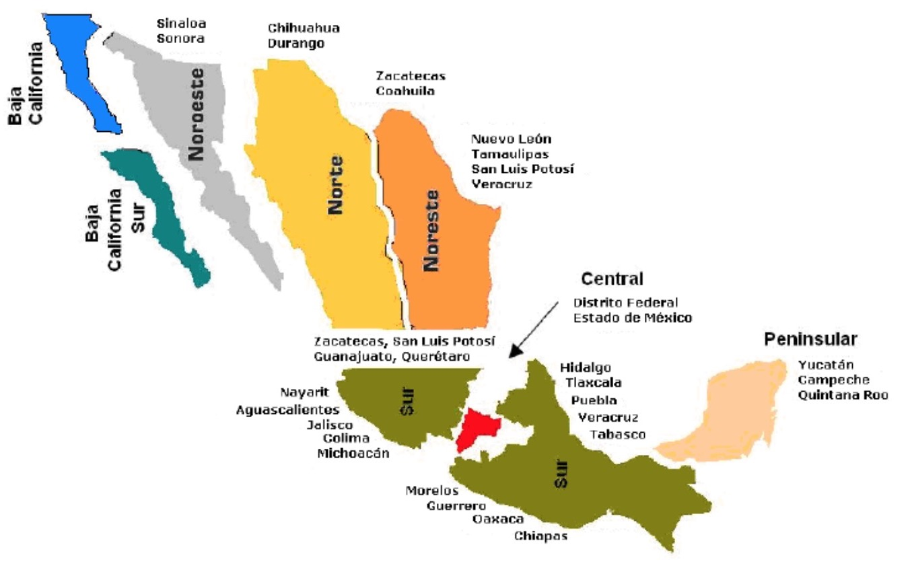
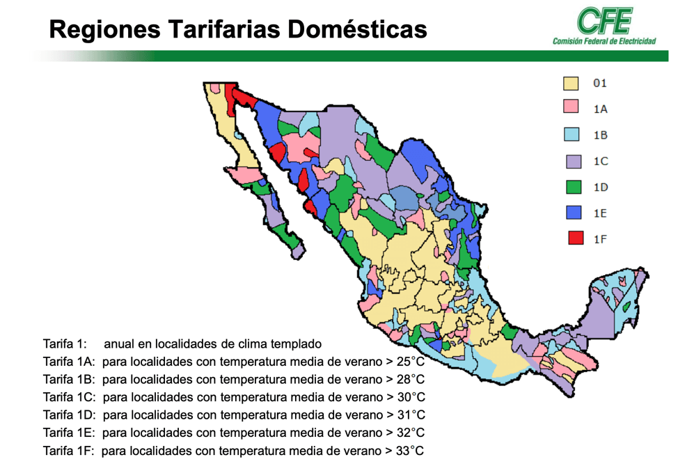
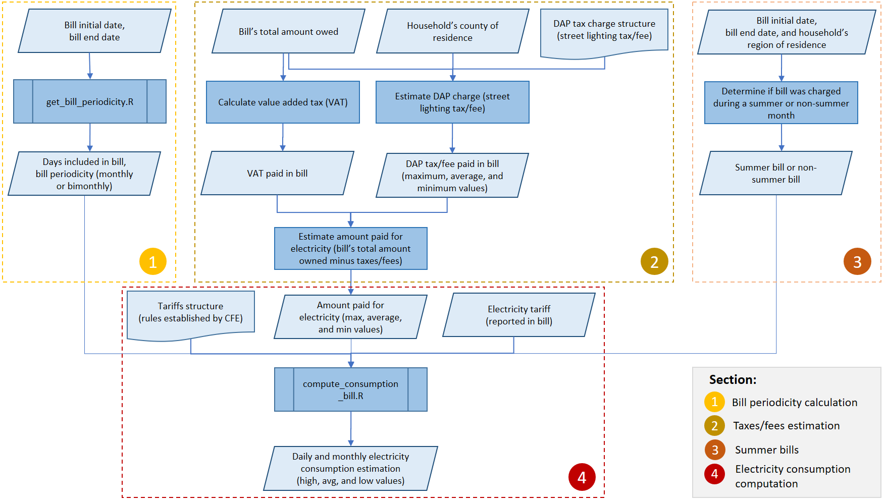

# Objective
This section presents the steps performed to compute the daily electricity consumption of the households surveyed by INEGI (from January 8 to June 29, 2018), based on the total amount paid in their electricity bills^1^. To compute the electricity consumption of each household^2^, we used the dataset that resulted from the [previous section](./01_descr_stats.html). Then, we combined this dataset with several pieces of information that were collected in the survey and with external data regarding the Federal Electricity Commission (CFE) tariffs. Because there are some missing data about how CFE charges some taxes to many of its customers, we were unable to compute the electricity consumption value for each costumer. As a result, we instead we computed three  electricity consumption values for each household: low, medium, and high^3^. 

Estimate the periodicity in which users pay their electricity bill.


^1^ Although ENCEVI collected some data about the last electricity bill paid by households, it did not collect data about the amount of electricity consumed. So, we had to calculate the electricity consumption.

^2^ We computed the electricity consumption only of the households that provided all the required data from their last electricity bill. For instance, if a household did not provide data about their bill period, its information was not used in this analysis.

^3^ low electricity consumption values are the minimum estimated cost of electricity that a household paid based on their tariff and the minimum tax that could be charged. While, high electricity consumption  values are the maximum estimated cost of electricity based on the same parameters. Finally, the medium electricity consumption is the average of the low and high values.


Notes: Dollar Exchange Rate: 	18.70	15-Mar-18

```{r, include=FALSE}
#Remove all objects from current workspace and call garbage collector
rm(list=ls())
gc()

source("./script/general_setup_functions.R")
source("./script/compute_consumption_bill.R")
source("./script/get_bill_periodicity.R")
```

```{r knitr_init, include=FALSE}
#options(max.print = "75")
opts_chunk$set(echo = TRUE,
	             cache = FALSE,
               prompt = FALSE,
               tidy = FALSE,
               comment = NA,
               message = FALSE,
               warning = FALSE,
               fig.path = 'figures/')
```

```{r setup, include=FALSE}
#Generates the css needed by summarytools
st_css()

#devtools::install_github("ropensci/plotly")
knitr::opts_chunk$set(fig.width = 8, collapse = TRUE)

knitr::knit_hooks$set(output = function(x, options){
  if(!is.null(options$max_height)){
    paste('<pre style = "max-height:',
          options$max_height, 
          ';float: left; width: 910px; overflow-y: auto;">',
          x,
          "</pre>",
          sep = "")
  } else{
    x
  }
})
```

**Loading datasets**
</br>This dataset was obtained with the "electricity_analysis.Rmd" file.

```{r}
df.enc.dwell <- read.csv("./output/encevi_dwelling_temp.csv", header = TRUE, na.strings="")
df.enc.dwell$X.1 <- NULL


df.dap.tax <- read.csv("./input/tariffs_dap_tax.csv", header = TRUE, na.strings="")
# Remove duplicated rows based on ageem.id
df.dap.tax <- df.dap.tax[!duplicated(df.dap.tax$ageem.id), ]
rownames(df.dap.tax) <- df.dap.tax$ageem.id
#drop columns 'state' and 'municipality'df.dap.tax <- df.dap.tax[ ,!(names(df.dap.tax) %in% c("state", "municipality"))]

colnames(df.enc.dwell)[colnames(df.enc.dwell)=="agem"] <- "ageem.id"
```

# Classification of Regional Tariffs

The Federal Electricity Commission (CFE) has divided the country into 8 regions (Source: https://energypedia.info/images/archive/f/fb/20180124234349%21GIZ_Tutorial_Tarifas_El%C3%A9ctricas_2015.pdf).

1. **Baja California (BC)**: All the municipalities of the state of Baja California state and the municipalitiy "San Luis Río Colorado" located in the neighboring state of Sonora.
2. **Baja California Sur (BCS)**: All the municipalities of the state of Baja California Sur. 
3. **Central**: All the counties of Mexico city. state of Mexico's municipalities: Tultepec, Tultitlán, Ixtapaluca, Chalco de Díaz Covarrubias, Huixquilucan de Degollado, San Mateo Atenco, Toluca, Santa Cruz Atizapán, Cuautitlán, Coacalco, Cuautitlán Izcalli, Atizapán de Zaragoza, Tlalnepantla, Naucalpan de Juárez, Ecatepec, Chimalhuacán, Chicoloapan, Texcoco, Netzahualcóyotl, Los Reyes la Paz. Municipalities of the state of Morelos: Cuernavaca.
4. **Northeast**: All the municipalities of the states of Nuevo León and Tamaulipas. All the municipalities of the state of Coahuila, except the ones included in the _North_ region (see below). Municipalities of the state of Zacatecas: Concepción del Oro, and el Salvador. Municipalities of the state of San Luis Potosí: Vanegas, Cedral, Cerritos, Guadalcázar, Ciudad Fernández, Río Verde, San Ciro de Acosta, Lagunillas, Santa Catarina, Rayón Cárdenas, Aloquines, Ciudad del Maíz, Ciudad Valles, Tamazopo, Alquismo, Axtla de Terrazas, Tamazunchale, Vicente Tancuayalab, Ébano, Xilitla, Yampacan, Tanquían de Escobedo. Municipalities of the state of Veracruz: Pánuco, Tempoal, Pueblo Viejo, Tampico Alto, Ozuluama de Mazcareñas, El Higo, Huayacocotla.
5. **Northwest**: All the municipalities of the state of Sonora, except San Luis Río Colorado. All the municipalities of the state of Sinaloa.
6. **North**: All the municipalities of the states of Chihuahua, and Durango. Municipalities of the state of Zacatecas: Clalchihuites, Jiménez del Teúl Sombrerete, Saín Alto, Jerez, Juan Adama, Río Grande, General Francisco Murguía, Mazapil, and Melchor Acampo. Municipalities of the state of Coahuila: Torreón, San Pedro de las Colonias, Matamoros, Viesca, Parras de la Fuente, and Francisco I. Madero. 
7. **Peninsular**: All the municipalities of the states of Yucatán, Campeche, and Quintana Roo.
8. **South**: All the municipalities of the states of Nayarit, Jalisco, Colima, Michoacán, Aguascalientes, Guanajuato, Querétaro, Hidalgo, Guerrero, Tlaxcala, Puebla, Oaxaca, Chiapas, Tabasco. All the municipalities of the states of Zacatecas, San Luis Potosí, and Veracruz not included in the _North_ or _Northern_ region. All the municipalities of the states of México y Morelos not included in the central region.

These regions are used to define the initial and end days of the summer months.

```{r, fig-map-region-tariff, figure_captions("fig_map_region_tariff", "Regional Tariffs"), out.width='95%', fig.pos="h"}

```


```{r}
df.enc.dwell$region.tariff.f <- factor(df.enc.dwell$region.tariff.f,
                               levels = c(1, 2, 3, 4, 5, 6, 7, 8),
                               labels = c("BC", "BCS", "Central", 
                                          "Northeast", "Northwest", 
                                          "North", "Peninsular", "South"))

df.enc.dwell$dwelling.size <- ordered(df.enc.dwell$dwelling.size, 
                                           levels = c(">30m2", "31-55m2", 
                                                      "56-75m2", "76-100m2", 
                                                      "101-150m2", "151-200m2", 
                                                      "<201m2", "Don't know"))
```


```{r tbl-tariff-region}
tb.tariff.region <- freq(df.enc.dwell$region.tariff.f, weight = df.enc.dwell$factor_sem,  
                plain.ascii = F, style = "simple", 
                method = "render", headings = F, na.rm= F)

knitr::kable(tb.tariff.region, 
      label = 'table-tariff-region', digits = 3, align = 'c', booktabs = TRUE,
  caption = 'Homes divided by tariff region') %>%
  kable_styling(bootstrap_options = c("striped", "hover", "condensed", "responsive"),
                fixed_thead = T, full_width = F)
```

## Dwellings Divided by Tariff

There are seven regular residential tariff classes (i.e., categories): 1, 1A, 1B, 1C, 1D, 1E, and 1F, which are set by CFE based on the average temperature of each municipality during the hottest months of the year (summer season). 

Each tariff class consists of three or four consumption blocks. The corresponding block lengths and marginal prices differ considerably across tariff classes for both summer and no-summer seasons. 

```{r}
df.enc.dwell$tipo_tarif.f <- factor(df.enc.dwell$tipo_tarif,
                               levels = c(0, 1, 2, 3, 4, 5, 6, 7, 8, 9),
                               labels = c("2", "1", "1A", "1B", "1C", "1D", 
                                          "1E", "1F", "DAC", "Don't know"))
```

Reference: [CFE Current Tariff Structure, 2019](http://www.cfe.mx/tarifas/Pages/Tarifas.aspx) </br>
```{r tbl-tariff.f, results = "hide"}
df.miss.tariff <- format(prop.table(table(df.enc.dwell$tipo_tarif.f, 
                                          exclude = NULL))*100, digits=3)
df.miss.tariff <-as.data.frame(t(df.miss.tariff), stringsAsFactors=FALSE, 
                               row.names = c("percent"))

# Convert values to numeric
df.miss.tariff[ ] <- lapply(df.miss.tariff, function(x) as.numeric(as.character(x)))

# Changing name of last column to NA
names(df.miss.tariff)[length(df.miss.tariff)] <- "NAs"
#names(df.miss.tariff)[10] <- "Unknown"
colnames(df.miss.tariff)[colnames(df.miss.tariff)=="Don't know"] <- "Unknown"

#To correct bug with naming column that uses ' in its name:
colnames(df.miss.tariff)[colnames(df.miss.tariff)=="V1"] <- "Unknown"
#Adding records with missing and unknown values
percent.tariff.miss <- df.miss.tariff$Unknown + df.miss.tariff$NAs

knitr::kable(df.miss.tariff, label = 'table-freq-tarif.f', digits = 3, 
      align = 'r', booktabs = TRUE, full_width = FALSE,
  caption = 'Frequency table of electric tariffs - Households Surveyed') %>%
  kable_styling(bootstrap_options = c("striped", "hover", "condensed", "responsive")) 

write.csv(df.miss.tariff,"./output/tables/df_miss_tariff.csv", row.names = FALSE)
```


```{r tbl-freq-tariff}
df.enc.dwell$tipo_tarif.f [df.enc.dwell$tipo_tarif.f == "Don't know"] <- NA
df.enc.dwell$tipo_tarif.f [df.enc.dwell$tipo_tarif.f == ""] <- NA
df.enc.dwell$tipo_tarif.f <- droplevels(df.enc.dwell$tipo_tarif.f)

tb.freq.tariff<- freq(df.enc.dwell$tipo_tarif.f, report.nas = TRUE, 
                       style = "rmarkdown", weights = df.enc.dwell$factor_sem, 
                       headings = FALSE, na.rm = TRUE)


knitr::kable(tb.freq.tariff, label = 'table-freq-tariff', digits = 3, 
      align = 'r', booktabs = TRUE, full_width = FALSE,
  caption = 'Distribution of electric tariffs') %>%
  kable_styling(bootstrap_options = c("striped", "hover", "condensed", 
                                      "responsive"),
                fixed_thead = TRUE)  %>%
  row_spec(10, bold = T, color = "white", background = "#D7261E")
```
**Replacing missing and unknown values**

As `r myround(percent.tariff.miss, 2)`% of the responders in ENCEVI didn't provide information about their electric tariff, we tried to estimate the tariffs of these responders by combining the data of ENCEVI's survey with the information of the type of tariff predominant in each municipality.

First, we replaced the empty values by "NA" in the variable _tipo.tarif.f_ (this variable has the data of tariffs from ENCEVI). Then, we created a new variable called _tariff.merge_, where we stored the values of the variable _tipo.tarif.f_ and we replaced its "NA" and "Don't know" values by the values stored in the variable _tariff_ (this variable has the data of the tariffs per municipality).
```{r tbl-tariff-merge}
# This electric tariff  was collected in ENCEVI's survey
df.enc.dwell$tipo_tarif.f[df.enc.dwell$tipo_tarif.f == ""] <- NA
df.enc.dwell$tipo_tarif.f <- droplevels(df.enc.dwell$tipo_tarif.f)

# This electric tariffs are the most common tariffs in each municipality
df.enc.dwell$tariff[df.enc.dwell$tariff == ""] <- NA
#df.enc.dwell$tariff <- droplevels(df.enc.dwell$tariff)

df.enc.dwell$tariff.merge <- df.enc.dwell$tipo_tarif.f
df.enc.dwell$tariff.merge[df.enc.dwell$tariff.merge == "Don't know"] <- "NA"
df.enc.dwell$tariff.merge[is.na(df.enc.dwell$tariff.merge)] <- df.enc.dwell$tariff

df.enc.dwell$tariff.merge <- droplevels(df.enc.dwell$tariff.merge)

tb.tariff.merge <- freq(df.enc.dwell$tariff.merge, report.nas = TRUE, 
                       style = "rmarkdown",  
                       headings = FALSE, na.rm = TRUE)

#tb.tariff.merge <- freq(df.enc.dwell$tariff.merge, report.nas = TRUE, 
#                       style = "rmarkdown", weights = df.enc.dwell$factor_sem, 
#                       headings = FALSE, na.rm = TRUE)


knitr::kable(tb.tariff.merge, label = 'table-freq-tarif.merge', digits = 3, 
      align = 'r', booktabs = TRUE, full_width = FALSE,
  caption = 'Distribution of electric tariffs after correction') %>%
  kable_styling(bootstrap_options = c("striped", "hover", "condensed", 
                                      "responsive"),
                fixed_thead = TRUE)  %>%
row_spec(10, bold = T, color = "white", background = "#D7261E")

write.csv(tb.tariff.merge,"./output/tables/tb_tariff_merge.csv", row.names = TRUE)

```


```{r}
df.enc.dwell.sub <- subset(df.enc.dwell, !is.na(df.enc.dwell$tariff.merge))
```


The procedure described above, allowed us to reduce the unknown tariffs to `r myround(tb.tariff.merge[10,4], 2)`%.

_It is important to mention that some of the tariffs estimated in the variable tariff.merge (especifically, the ones that have a value of NA or "Don't know" in the variable tipo.tarif.f) should be classified as high consumption tariff (DAC). In further steps, when we evaluate the expenses in electricity, we will estimate which variables are DAC._


# Residential Tariffs Rate Structure
As mentioned above the price of electricity in the Mexican residential sector varies by location (climate) and season (summer and no summer). For each tariff there are subsidies of electricity according to consumption limits. For each tariff there are between 3 and 4 blocks with different subsidies. As a customer consumes more electricity, the subidies are reduced, until a maximum limit is reached and the subsidies are eliminated. This information is shown in :

```{r}
## Loading information
df.tariff.cost <- read.csv("./input/tariffs_rate_structure.csv")
```
             
```{r tbl-tariff-struct}
knitr::kable(df.tariff.cost[ , 1:8], 
      label = 'table-tariff-struct', digits = 2, align = 'l', booktabs = T,
  caption = 'Residential tariffs structure') %>%
  kable_styling(bootstrap_options = c("striped", "hover", 
                                      "condensed", "responsive"),
                fixed_thead = T, full_width = F) %>%
  scroll_box(width = "100%", height = "300px")


write.csv(df.tariff.cost[ , 1:8],"./output/tables/tariff_cost.csv", row.names = TRUE)
```

```{r, fig-map-tariffs, figure_captions("fig_map_tariffs", "Tariff Regions"), out.width='95%', fig.pos="h"}

```

# Computing Electricity Consumption

`r f.ref("fig_algorithm_cons")` shows the algorithm used to compute the electricity consumption of the households surveyed by ENCEVI. The first step we follow was to estimate the 

Some considerations for the calculation of the electricity consumption reported in each bill are:

1. CFE's customers are billed monthly or bi-monthly. There is not a clear rule about the periodicity in which customers are billed.
2. The minimum payment per month is equal to 25 KWh. This means that if a user consumes less than 25 KWh in a month (or in two months if they have bi-monthly bills), they will be charged the price of 25KWh based on their tariff. 
3. Each bill includes a 16% value added tax (known as IVA). 
4. Each bill includes a tax known as DAP that is charged to customers to cover the cost of the public street lighting system in Mexico. This tax is different for each municipality.
5. If a user has a high consumption (known as DAC Tariff), they will also pay a fixed monthly fee (around MXN$100). This fee is different for each region and it is calculated every month.
6. Summer months


```{r, fig-algorithm-cons, figure_captions("fig_algorithm_cons", "Algorithm used to compute electricity consumption from bill"), out.width='95%', fig.pos="h"}

```


## Billing Periodicity 

## Periodicity of Electricity Bill 
In ENCEVI survey, responders provided information of the initial and end dates (day and month) of their last electricity bill. <i>Note: Data about the year was not collected</i>. 

The survey also collected information about how much users had to pay to cover their bill. Unfortunately, the survey did not collect data of the electricity consumption, so these data have to be calculated from the electricity expenses. As the Federal Electricity Commission (CFE) has different tariffs for their clients based on season (summer and no summer), location (region), and consumption (expenses are subsidized based on consumption).

<i>A complete description of the electricity consumption and estimation of tariffs can be found in the file "estimating_tariffs_consumption"</i>

To estimate the electricity consumption of each household surveyed, we started by estimating the number of days that were covered in the electricity bills of the households surveyed. Along these lines, this section shows the steps we followed to clean the data and compute the number of the days billed [@ramirez-camperos_mexican_2013].

```{r}
#TODO: eliminate this source statement
source("./script/get_bill_periodicity.R")

df.enc.dwell$mes_inic1[df.enc.dwell$mes_inic1 == 99] <- NA
df.enc.dwell$mes_final1[df.enc.dwell$mes_final1 == 99] <- NA
df.enc.dwell$inicia1[df.enc.dwell$inicia1 == 99] <- NA
df.enc.dwell$final1[df.enc.dwell$final1 == 99] <- NA

df.bill.dates <- subset(df.enc.dwell,
                        select=c(folio, mes_inic1, inicia1, mes_final1, final1), !is.na(df.enc.dwell$tariff.merge))

#df.bill.dates <- subset(df.enc.dwell,
#                        select=c(folio, mes_inic1, inicia1, mes_final1, final1), #df.enc.dwell$tariff.merge != "NA")

setnames(df.bill.dates, 
         old=c("mes_inic1", "inicia1", "mes_final1", "final1"), 
         new=c("mes_inic", "inicia", "mes_final", "final"))

df.bill.dates <- GetBillPeriodicity (df.bill.dates)

descr(df.bill.dates, stats = c("mean", "sd", "min", "med", "max", "n.valid", "pct.valid"), 
      transpose = TRUE)
```
```{r}
#df.bill.dates2 <- subset(df.bill.dates, is.na(bill.days))
df.bill.dates2 <- subset(df.bill.dates, mes_final >= 1 & mes_inic >=1 & is.na(bill.days))
dim(df.bill.dates2)
descr(df.bill.dates2, stats = c("mean", "sd", "min", "med", "max", "n.valid", "pct.valid"), transpose = TRUE)
```

**Calculate number of months covered in each bill **
```{r}
df.bill.dates['num_month_bill'] <- NA

df.bill.dates$year.ini <- as.integer(df.bill.dates$year.ini)
df.bill.dates$year.end <- as.integer(df.bill.dates$year.end)

FillMonthsGap<-function(month_end, month_ini, days_valid, months_bill){
  if (!is.na(month_end) & !is.na(month_ini) & (month_end >= month_ini) & is.na(days_valid) ){
      month_end - month_ini
  }
    
  else if (!is.na(month_end) & !is.na(month_ini) & (month_end < month_ini) & is.na(days_valid)){
      (12 - month_ini) + month_end
    }
  
  else {
    months_bill
  }
}

df.bill.dates$num_month_bill = as.numeric(difftime(df.bill.dates$bill.end.date, 
                                                   df.bill.dates$bill.ini.date, units ="days"))/(365.25/12)

df.bill.dates$num_month_bill <- mapply(FillMonthsGap, df.bill.dates$mes_final, 
                                    df.bill.dates$mes_inic, 
                                    df.bill.dates$bill.days.valid, 
                                    df.bill.dates$num_month_bill)
```

**Bill dates after calculated number of months in each bill**

```{r}
descr(df.bill.dates, 
      stats = c("mean", "sd", "min", "med", "max", "n.valid", "pct.valid"), 
      transpose = TRUE)
```

```{r}
df.enc.dwell$mes_final <- NULL
df.enc.dwell$mes_final.x <- NULL
df.enc.dwell$mes_final.y <- NULL

df.enc.dwell$mes_inic <- NULL
df.enc.dwell$mes_inic.x <- NULL
df.enc.dwell$mes_inic.y <- NULL

df.enc.dwell <- merge(df.enc.dwell, df.bill.dates, by="folio")

setnames(df.enc.dwell, 
         old=c("bill.days","bill.days.valid", "bill.ini.date", 
               "bill.end.date", "year.ini", "year.end", "num_month_bill"), 
         new=c("bill.days1", "bill.days1.valid", "bill.ini.date1", 
               "bill.end.date1", "year.ini1", "year.end1", "num_month_bill.x"))
<<<<<<< HEAD
```


```{r}
descr(df.enc.dwell$bill.days1.valid, 
     # weights = df.enc.dwell$factor_sem, 
      stats = c("mean", "sd", "min", "med", "max", "n.valid", "pct.valid"), 
      transpose = TRUE)
```

*Monthly bills before data recovery*
```{r}
CreateMonthBillHistPlots <- function(month, legend){
  #Ref: https://plotly.com/r/text-and-annotations/
  sample_size = sum(complete.cases(df.enc.dwell$bill.days1.valid[df.enc.dwell$mes_inic == month & df.enc.dwell$num_month_bill > 0.95 & df.enc.dwell$num_month_bill <= 1.5 ]), na.rm = TRUE)
  
  f <- list(
  family = "Courier New, monospace",
  size = 18,
  color = "#7f7f7f ")
  
  a <- list(
    x = 37,
    y = 0.75,
    text = paste0("n=", sample_size),
    xref = "x",
    yref = "y",
    showarrow = FALSE,
    arrowhead = 7,
    ax = 20,
    ay = -40,
    titlefont = f)
  
  x <- list(
    title = "x Axis",
    titlefont = f)
  
  y <- list(
    title = "y Axis",
    titlefont = f)


  fit <- density(df.enc.dwell$bill.days1.valid[df.enc.dwell$mes_inic == month & df.enc.dwell$num_month_bill > 0.95 & df.enc.dwell$num_month_bill <= 1.5 ], na.rm = TRUE)
  
  myplt <- plot_ly(x = df.enc.dwell$bill.days1.valid[df.enc.dwell$mes_inic == month & df.enc.dwell$num_month_bill > 0.95 & df.enc.dwell$num_month_bill <= 1.5 ],
               type = "histogram",
               histnorm = "probability",
               name = legend) %>%
      #add_trace(x = fit$x, y = fit$y, yaxis = "y2", name = "Density") %>%
    layout(title = 'Distribution of Days Billed Reported by ENCEVI (Monthly Bills) - Before Data Recovery',
           xaxis = list(title = "days", range = c(20, 40)), 
           yaxis = list(title = "Probability", range = c(0, 0.9)),
           legend = list(title = "month"),
           #yaxis2 = list(overlaying = "y", side = "right")
           annotations = a
           )
  myplt
}

plotList <- function(seq_months) {
    lapply(seq_len(length(seq_months)), function(x) CreateMonthBillHistPlots(seq_months))
}

s1 <- subplot(CreateMonthBillHistPlots(1, 'jan'), CreateMonthBillHistPlots(2, 'feb'), 
              CreateMonthBillHistPlots(3, 'mar'), CreateMonthBillHistPlots(4, 'apr'), 
              nrows = 1, shareX = TRUE, shareY = TRUE)

s2 <- subplot(CreateMonthBillHistPlots(5, 'may'), CreateMonthBillHistPlots(6, 'jun'), 
              CreateMonthBillHistPlots(7, 'jul'), CreateMonthBillHistPlots(8, 'aug'),  
              nrows = 1, shareX = TRUE, shareY = TRUE)

s3 <- subplot(CreateMonthBillHistPlots(9, 'sep'), CreateMonthBillHistPlots(10, 'oct'), 
              CreateMonthBillHistPlots(11, 'nov'), CreateMonthBillHistPlots(12, 'dec'),  
              nrows = 1, shareX = TRUE, shareY = TRUE)

fig <- subplot(s1, s2, s3, nrows = 3, margin = 0.04, heights = c(0.33, 0.33, 0.34)) 

fig

plotly_IMAGE(fig, format = "png", 
             out_file = "./output/fig/hist_bill_period_per_month_monthly_before.png")
```

*Bimontly bills before data recovery*
```{r}
CreateBimonthBillHistPlots<-function(month, legend){
  #Ref: https://plotly.com/r/text-and-annotations/
  sample_size = sum(complete.cases(df.enc.dwell$bill.days1.valid[df.enc.dwell$mes_inic == month & df.enc.dwell$num_month_bill > 1.5 & df.enc.dwell$num_month_bill <= 2.5 ]), na.rm = TRUE)
  
  f <- list(
=======
```


```{r}
descr(df.enc.dwell$bill.days1.valid, 
     # weights = df.enc.dwell$factor_sem, 
      stats = c("mean", "sd", "min", "med", "max", "n.valid", "pct.valid"), 
      transpose = TRUE)
```

*Monthly bills before data recovery*
```{r}
CreateMonthBillHistPlots <- function(month, legend){
  #Ref: https://plotly.com/r/text-and-annotations/
  sample_size = sum(complete.cases(df.enc.dwell$bill.days1.valid[df.enc.dwell$mes_inic == month & df.enc.dwell$num_month_bill > 0.95 & df.enc.dwell$num_month_bill <= 1.5 ]), na.rm = TRUE)
  
  f <- list(
  family = "Courier New, monospace",
  size = 18,
  color = "#7f7f7f ")
  
  a <- list(
    x = 37,
    y = 0.75,
    text = paste0("n=", sample_size),
    xref = "x",
    yref = "y",
    showarrow = FALSE,
    arrowhead = 7,
    ax = 20,
    ay = -40,
    titlefont = f)
  
  x <- list(
    title = "x Axis",
    titlefont = f)
  
  y <- list(
    title = "y Axis",
    titlefont = f)


  fit <- density(df.enc.dwell$bill.days1.valid[df.enc.dwell$mes_inic == month & df.enc.dwell$num_month_bill > 0.95 & df.enc.dwell$num_month_bill <= 1.5 ], na.rm = TRUE)
  
  myplt <- plot_ly(x = df.enc.dwell$bill.days1.valid[df.enc.dwell$mes_inic == month & df.enc.dwell$num_month_bill > 0.95 & df.enc.dwell$num_month_bill <= 1.5 ],
               type = "histogram",
               histnorm = "probability",
               name = legend) %>%
      #add_trace(x = fit$x, y = fit$y, yaxis = "y2", name = "Density") %>%
    layout(title = 'Distribution of Days Billed Reported by ENCEVI (Monthly Bills) - Before Data Recovery',
           xaxis = list(title = "days", range = c(20, 40)), 
           yaxis = list(title = "Probability", range = c(0, 0.9)),
           legend = list(title = "month"),
           #yaxis2 = list(overlaying = "y", side = "right")
           annotations = a
           )
  myplt
}

plotList <- function(seq_months) {
    lapply(seq_len(length(seq_months)), function(x) CreateMonthBillHistPlots(seq_months))
}

s1 <- subplot(CreateMonthBillHistPlots(1, 'jan'), CreateMonthBillHistPlots(2, 'feb'), 
              CreateMonthBillHistPlots(3, 'mar'), CreateMonthBillHistPlots(4, 'apr'), 
              nrows = 1, shareX = TRUE, shareY = TRUE)

s2 <- subplot(CreateMonthBillHistPlots(5, 'may'), CreateMonthBillHistPlots(6, 'jun'), 
              CreateMonthBillHistPlots(7, 'jul'), CreateMonthBillHistPlots(8, 'aug'),  
              nrows = 1, shareX = TRUE, shareY = TRUE)

s3 <- subplot(CreateMonthBillHistPlots(9, 'sep'), CreateMonthBillHistPlots(10, 'oct'), 
              CreateMonthBillHistPlots(11, 'nov'), CreateMonthBillHistPlots(12, 'dec'),  
              nrows = 1, shareX = TRUE, shareY = TRUE)

fig <- subplot(s1, s2, s3, nrows = 3, margin = 0.04, heights = c(0.33, 0.33, 0.34)) 

fig

plotly_IMAGE(fig, format = "png", 
             out_file = "./output/fig/hist_bill_period_per_month_monthly_before.png")
```

*Bimontly bills before data recovery*
```{r}
CreateBimonthBillHistPlots<-function(month, legend){
  #Ref: https://plotly.com/r/text-and-annotations/
  sample_size = sum(complete.cases(df.enc.dwell$bill.days1.valid[df.enc.dwell$mes_inic == month & df.enc.dwell$num_month_bill > 1.5 & df.enc.dwell$num_month_bill <= 2.5 ]), na.rm = TRUE)
  
  f <- list(
  family = "Courier New, monospace",
  size = 18,
  color = "#7f7f7f ")
  
  a <- list(
    x = 68,
    y = 0.5,
    text = paste0("n=", sample_size),
    xref = "x",
    yref = "y",
    showarrow = FALSE,
    arrowhead = 7,
    ax = 20,
    ay = -40,
    titlefont = f)
  
  x <- list(
    title = "x Axis",
    titlefont = f)
  
  y <- list(
    title = "y Axis",
    titlefont = f)


  fit <- density(df.enc.dwell$bill.days1.valid[df.enc.dwell$mes_inic == month & df.enc.dwell$num_month_bill > 1.5 & df.enc.dwell$num_month_bill <= 2.5 ], na.rm = TRUE)
  
  myplt <- plot_ly(x = df.enc.dwell$bill.days1.valid[df.enc.dwell$mes_inic == month & df.enc.dwell$num_month_bill > 1.5 & 
                                            df.enc.dwell$num_month_bill <= 2.5 ],
               type = "histogram",
               histnorm = "probability",
               name = legend) %>%
      #add_trace(x = fit$x, y = fit$y, yaxis = "y2", name = "Density") %>%
    layout(title = 'Distribution of Days Billed Reported by ENCEVI (Bi-Monthly Bills) - Before Data Recovery',
           xaxis = list(title = "days", range = c(50, 70)), 
           yaxis = list(title = "Probability"),
           legend = list(title = "month"),
           #yaxis2 = list(overlaying = "y", side = "right")
           annotations = a
           )
  myplt
}


plotList <- function(seq_months) {
    lapply(seq_len(length(seq_months)), function(x) CreateBimonthBillHistPlots(seq_months))
}

s1 <- subplot(CreateBimonthBillHistPlots(1, 'jan'), CreateBimonthBillHistPlots(2, 'feb'), 
              CreateBimonthBillHistPlots(3, 'mar'), CreateBimonthBillHistPlots(4, 'apr'), 
              nrows = 1, shareX = TRUE, shareY = TRUE)

s2 <- subplot(CreateBimonthBillHistPlots(5, 'may'), CreateBimonthBillHistPlots(6, 'jun'), 
              CreateBimonthBillHistPlots(7, 'jul'), CreateBimonthBillHistPlots(8, 'aug'),  
              nrows = 1, shareX = TRUE, shareY = TRUE)

s3 <- subplot(CreateBimonthBillHistPlots(9, 'sep'), CreateBimonthBillHistPlots(10, 'oct'), 
              CreateBimonthBillHistPlots(11, 'nov'), CreateBimonthBillHistPlots(12, 'dec'),  
              nrows = 1, shareX = TRUE, shareY = TRUE)

f <- list(
>>>>>>> 9248e48701899e5efeb71c4495281c9f2a84be4b
  family = "Courier New, monospace",
  size = 18,
  color = "#7f7f7f ")
  
<<<<<<< HEAD
  a <- list(
    x = 68,
    y = 0.5,
    text = paste0("n=", sample_size),
    xref = "x",
    yref = "y",
    showarrow = FALSE,
    arrowhead = 7,
    ax = 20,
    ay = -40,
    titlefont = f)
  
  x <- list(
    title = "x Axis",
    titlefont = f)
  
  y <- list(
    title = "y Axis",
    titlefont = f)


  fit <- density(df.enc.dwell$bill.days1.valid[df.enc.dwell$mes_inic == month & df.enc.dwell$num_month_bill > 1.5 & df.enc.dwell$num_month_bill <= 2.5 ], na.rm = TRUE)
  
  myplt <- plot_ly(x = df.enc.dwell$bill.days1.valid[df.enc.dwell$mes_inic == month & df.enc.dwell$num_month_bill > 1.5 & 
                                            df.enc.dwell$num_month_bill <= 2.5 ],
               type = "histogram",
               histnorm = "probability",
               name = legend) %>%
      #add_trace(x = fit$x, y = fit$y, yaxis = "y2", name = "Density") %>%
    layout(title = 'Distribution of Days Billed Reported by ENCEVI (Bi-Monthly Bills) - Before Data Recovery',
           xaxis = list(title = "days", range = c(50, 70)), 
           yaxis = list(title = "Probability"),
           legend = list(title = "month"),
           #yaxis2 = list(overlaying = "y", side = "right")
           annotations = a
           )
  myplt
}


plotList <- function(seq_months) {
    lapply(seq_len(length(seq_months)), function(x) CreateBimonthBillHistPlots(seq_months))
}

s1 <- subplot(CreateBimonthBillHistPlots(1, 'jan'), CreateBimonthBillHistPlots(2, 'feb'), 
              CreateBimonthBillHistPlots(3, 'mar'), CreateBimonthBillHistPlots(4, 'apr'), 
              nrows = 1, shareX = TRUE, shareY = TRUE)

s2 <- subplot(CreateBimonthBillHistPlots(5, 'may'), CreateBimonthBillHistPlots(6, 'jun'), 
              CreateBimonthBillHistPlots(7, 'jul'), CreateBimonthBillHistPlots(8, 'aug'),  
              nrows = 1, shareX = TRUE, shareY = TRUE)

s3 <- subplot(CreateBimonthBillHistPlots(9, 'sep'), CreateBimonthBillHistPlots(10, 'oct'), 
              CreateBimonthBillHistPlots(11, 'nov'), CreateBimonthBillHistPlots(12, 'dec'),  
              nrows = 1, shareX = TRUE, shareY = TRUE)

f <- list(
  family = "Courier New, monospace",
  size = 18,
  color = "#7f7f7f ")
  
x <- list(
  title = "x Axis",
  titlefont = f)

y <- list(
  title = "y Axis",
  titlefont = f)


fig <- subplot(s1, s2, s3, nrows = 3, margin = 0.04, heights = c(0.33, 0.33, 0.34)) 
fig

plotly_IMAGE(fig, format = "png", 
             out_file = "./output/fig/hist_bill_period_per_month_bimonthly_before.png")
```


```{r}
#Store data before recovery
df.enc.dwell.unmod <- merge(df.enc.dwell, df.bill.dates, by="folio")

write.csv(df.enc.dwell, "./output/encevi_dwelling_merg_unmod.csv", 
           row.names=TRUE, na="")
```

### Data Recovery
Recovering only  bills with monthly periodicity
```{r}
#Loop to get median value of months in each bill with a monthly & bimonthly period 
for (month in seq(1, 12, 1)) {
    median_month <- median(df.bill.dates$bill.days.valid[df.bill.dates$num_month_bill >= 0.7 & 
                                                                 df.bill.dates$num_month_bill <= 1.45 & 
                                                                 df.bill.dates$mes_inic == month], na.rm = TRUE)
        
    df.bill.dates$bill.days.valid[df.bill.dates$num_month_bill >= 0.7 & 
                                          df.bill.dates$num_month_bill <= 1.45 & 
                                          is.na(df.bill.dates$bill.days.valid) & 
                                          df.bill.dates$mes_inic == month ] <- median_month
    

 
#    median_month <- median(df.bill.dates$bill.days.valid[df.bill.dates$num_month_bill > 0.95 & 
#                                                           df.bill.dates$num_month_bill <= 1.5 & 
#                                                           df.bill.dates$mes_inic == month], na.rm = TRUE)
    
#    df.bill.dates$bill.days.valid[df.bill.dates$num_month_bill > 0.95 & 
#                                          df.bill.dates$num_month_bill <= 1.5 & 
#                                          is.na(df.bill.dates$bill.days.valid) & 
#                                          df.bill.dates$mes_inic == month ] <- median_month
  
    
  #  median_bimonth <- median(df.bill.dates$bill.days.valid[df.bill.dates$num_month_bill > 1.5 & 
  #                                                           df.bill.dates$num_month_bill <= 2.5 & 
  #                                                           df.bill.dates$mes_inic == month], na.rm = TRUE) 
    
  #  df.bill.dates$bill.days.valid[df.bill.dates$num_month_bill > 1.5 & 
  #                                        df.bill.dates$num_month_bill <= 2.5 & 
  #                                        is.na(df.bill.dates$bill.days.valid) & 
  #                                        df.bill.dates$mes_inic == month] <- median_bimonth
}

descr(df.bill.dates, stats = c("mean", "sd", "min", "med", "max", "n.valid", "pct.valid"), transpose = TRUE)
```

**Merging bill dates dataframe after recovering monthly bills with ENCEVI dataframe**
```{r}
df.enc.dwell.modif <- merge(df.enc.dwell, df.bill.dates, by="folio")

df.enc.dwell.modif <- subset (df.enc.dwell.modif, select = -c(bill.days1, bill.days1.valid, bill.ini.date1, bill.end.date1, year.ini1, year.end1))

setnames(df.enc.dwell.modif, 
         old=c("bill.days","bill.days.valid", "bill.ini.date", 
               "bill.end.date", "year.ini", "year.end", "num_month_bill.x"), 
         new=c("bill.days1", "bill.days1.valid", "bill.ini.date1", 
               "bill.end.date1", "year.ini1", "year.end1", "num_month_bill"))
```

```{r}
descr(df.enc.dwell.modif$bill.days1.valid, 
      stats = c("mean", "sd", "min", "med", "max", "n.valid", "pct.valid"), 
      transpose = TRUE)
```


## Histogram of Monthly Bills After data recovery
```{r}
CreateMonthBillHistPlots<-function(month, legend){
  #Ref: https://plotly.com/r/text-and-annotations/
  sample_size = sum(complete.cases(df.enc.dwell.modif$bill.days1.valid[df.enc.dwell.modif$mes_inic1 == month & df.enc.dwell.modif$num_month_bill > 0.95 & 
                                            df.enc.dwell.modif$num_month_bill <= 1.5 ]), na.rm = TRUE)
  
  f <- list(
  family = "Courier New, monospace",
  size = 18,
  color = "#7f7f7f ")
  
  a <- list(
    x = 37,
    y = 0.75,
    text = paste0("n=", sample_size),
    xref = "x",
    yref = "y",
    showarrow = FALSE,
    arrowhead = 7,
    ax = 20,
    ay = -40,
    titlefont = f)
  
  x <- list(
    title = "x Axis",
    titlefont = f)
  
  y <- list(
    title = "y Axis",
    titlefont = f)


  fit <- density(df.enc.dwell.modif$bill.days1.valid[df.enc.dwell.modif$mes_inic1 == month & df.enc.dwell.modif$num_month_bill > 0.95 & df.enc.dwell.modif$num_month_bill <= 1.5 ], na.rm = TRUE)
  
  myplt <- plot_ly(x = df.enc.dwell.modif$bill.days1.valid[df.enc.dwell.modif$mes_inic1 == month & df.enc.dwell.modif$num_month_bill > 0.95 & df.enc.dwell.modif$num_month_bill <= 1.5 ],
               type = "histogram",
               histnorm = "probability",
               name = legend) %>%
      #add_trace(x = fit$x, y = fit$y, yaxis = "y2", name = "Density") %>%
    layout(title = 'Distribution of Days Billed Reported by ENCEVI (Monthly Bills) - After Data Recovery',
           xaxis = list(title = "days", range = c(20, 40)), 
           yaxis = list(title = "Probability", range = c(0, 0.9)),
           legend = list(title = "month"),
           #yaxis2 = list(overlaying = "y", side = "right")
           annotations = a
           )
  myplt
}


plotList <- function(seq_months) {
    lapply(seq_len(length(seq_months)), function(x) CreateMonthBillHistPlots(seq_months))
}

s1 <- subplot(CreateMonthBillHistPlots(1, 'jan'), CreateMonthBillHistPlots(2, 'feb'), 
              CreateMonthBillHistPlots(3, 'mar'), CreateMonthBillHistPlots(4, 'apr'), 
              nrows = 1, shareX = TRUE, shareY = TRUE)

s2 <- subplot(CreateMonthBillHistPlots(5, 'may'), CreateMonthBillHistPlots(6, 'jun'), 
              CreateMonthBillHistPlots(7, 'jul'), CreateMonthBillHistPlots(8, 'aug'),  
              nrows = 1, shareX = TRUE, shareY = TRUE)

s3 <- subplot(CreateMonthBillHistPlots(9, 'sep'), CreateMonthBillHistPlots(10, 'oct'), 
              CreateMonthBillHistPlots(11, 'nov'), CreateMonthBillHistPlots(12, 'dec'),  
              nrows = 1, shareX = TRUE, shareY = TRUE)

f <- list(
  family = "Courier New, monospace",
  size = 18,
  color = "#7f7f7f ")
  
x <- list(
  title = "x Axis",
  titlefont = f)

y <- list(
  title = "y Axis",
  titlefont = f)


fig <- subplot(s1, s2, s3, nrows = 3, margin = 0.04, heights = c(0.33, 0.33, 0.34)) 

fig
=======
x <- list(
  title = "x Axis",
  titlefont = f)

y <- list(
  title = "y Axis",
  titlefont = f)


fig <- subplot(s1, s2, s3, nrows = 3, margin = 0.04, heights = c(0.33, 0.33, 0.34)) 
fig

plotly_IMAGE(fig, format = "png", 
             out_file = "./output/fig/hist_bill_period_per_month_bimonthly_before.png")
```


```{r}
#Store data before recovery
df.enc.dwell.unmod <- merge(df.enc.dwell, df.bill.dates, by="folio")

write.csv(df.enc.dwell, "./output/encevi_dwelling_merg_unmod.csv", 
           row.names=TRUE, na="")
```

### Data Recovery
Recovering only  bills with monthly periodicity
```{r}
#Loop to get median value of months in each bill with a monthly & bimonthly period 
for (month in seq(1, 12, 1)) {
    median_month <- median(df.bill.dates$bill.days.valid[df.bill.dates$num_month_bill >= 0.7 & 
                                                                 df.bill.dates$num_month_bill <= 1.45 & 
                                                                 df.bill.dates$mes_inic == month], na.rm = TRUE)
        
    df.bill.dates$bill.days.valid[df.bill.dates$num_month_bill >= 0.7 & 
                                          df.bill.dates$num_month_bill <= 1.45 & 
                                          is.na(df.bill.dates$bill.days.valid) & 
                                          df.bill.dates$mes_inic == month ] <- median_month
    

 
#    median_month <- median(df.bill.dates$bill.days.valid[df.bill.dates$num_month_bill > 0.95 & 
#                                                           df.bill.dates$num_month_bill <= 1.5 & 
#                                                           df.bill.dates$mes_inic == month], na.rm = TRUE)
    
#    df.bill.dates$bill.days.valid[df.bill.dates$num_month_bill > 0.95 & 
#                                          df.bill.dates$num_month_bill <= 1.5 & 
#                                          is.na(df.bill.dates$bill.days.valid) & 
#                                          df.bill.dates$mes_inic == month ] <- median_month
  
    
  #  median_bimonth <- median(df.bill.dates$bill.days.valid[df.bill.dates$num_month_bill > 1.5 & 
  #                                                           df.bill.dates$num_month_bill <= 2.5 & 
  #                                                           df.bill.dates$mes_inic == month], na.rm = TRUE) 
    
  #  df.bill.dates$bill.days.valid[df.bill.dates$num_month_bill > 1.5 & 
  #                                        df.bill.dates$num_month_bill <= 2.5 & 
  #                                        is.na(df.bill.dates$bill.days.valid) & 
  #                                        df.bill.dates$mes_inic == month] <- median_bimonth
}

descr(df.bill.dates, stats = c("mean", "sd", "min", "med", "max", "n.valid", "pct.valid"), transpose = TRUE)
```

**Merging bill dates dataframe after recovering monthly bills with ENCEVI dataframe**
```{r}
df.enc.dwell.modif <- merge(df.enc.dwell, df.bill.dates, by="folio")

df.enc.dwell.modif <- subset (df.enc.dwell.modif, select = -c(bill.days1, bill.days1.valid, bill.ini.date1, bill.end.date1, year.ini1, year.end1))

setnames(df.enc.dwell.modif, 
         old=c("bill.days","bill.days.valid", "bill.ini.date", 
               "bill.end.date", "year.ini", "year.end", "num_month_bill.x"), 
         new=c("bill.days1", "bill.days1.valid", "bill.ini.date1", 
               "bill.end.date1", "year.ini1", "year.end1", "num_month_bill"))
```

```{r}
descr(df.enc.dwell.modif$bill.days1.valid, 
      stats = c("mean", "sd", "min", "med", "max", "n.valid", "pct.valid"), 
      transpose = TRUE)
```


## Histogram of Monthly Bills After data recovery
```{r}
CreateMonthBillHistPlots<-function(month, legend){
  #Ref: https://plotly.com/r/text-and-annotations/
  sample_size = sum(complete.cases(df.enc.dwell.modif$bill.days1.valid[df.enc.dwell.modif$mes_inic1 == month & df.enc.dwell.modif$num_month_bill > 0.95 & 
                                            df.enc.dwell.modif$num_month_bill <= 1.5 ]), na.rm = TRUE)
  
  f <- list(
  family = "Courier New, monospace",
  size = 18,
  color = "#7f7f7f ")
  
  a <- list(
    x = 37,
    y = 0.75,
    text = paste0("n=", sample_size),
    xref = "x",
    yref = "y",
    showarrow = FALSE,
    arrowhead = 7,
    ax = 20,
    ay = -40,
    titlefont = f)
  
  x <- list(
    title = "x Axis",
    titlefont = f)
  
  y <- list(
    title = "y Axis",
    titlefont = f)


  fit <- density(df.enc.dwell.modif$bill.days1.valid[df.enc.dwell.modif$mes_inic1 == month & df.enc.dwell.modif$num_month_bill > 0.95 & df.enc.dwell.modif$num_month_bill <= 1.5 ], na.rm = TRUE)
  
  myplt <- plot_ly(x = df.enc.dwell.modif$bill.days1.valid[df.enc.dwell.modif$mes_inic1 == month & df.enc.dwell.modif$num_month_bill > 0.95 & df.enc.dwell.modif$num_month_bill <= 1.5 ],
               type = "histogram",
               histnorm = "probability",
               name = legend) %>%
      #add_trace(x = fit$x, y = fit$y, yaxis = "y2", name = "Density") %>%
    layout(title = 'Distribution of Days Billed Reported by ENCEVI (Monthly Bills) - After Data Recovery',
           xaxis = list(title = "days", range = c(20, 40)), 
           yaxis = list(title = "Probability", range = c(0, 0.9)),
           legend = list(title = "month"),
           #yaxis2 = list(overlaying = "y", side = "right")
           annotations = a
           )
  myplt
}


plotList <- function(seq_months) {
    lapply(seq_len(length(seq_months)), function(x) CreateMonthBillHistPlots(seq_months))
}

s1 <- subplot(CreateMonthBillHistPlots(1, 'jan'), CreateMonthBillHistPlots(2, 'feb'), 
              CreateMonthBillHistPlots(3, 'mar'), CreateMonthBillHistPlots(4, 'apr'), 
              nrows = 1, shareX = TRUE, shareY = TRUE)

s2 <- subplot(CreateMonthBillHistPlots(5, 'may'), CreateMonthBillHistPlots(6, 'jun'), 
              CreateMonthBillHistPlots(7, 'jul'), CreateMonthBillHistPlots(8, 'aug'),  
              nrows = 1, shareX = TRUE, shareY = TRUE)

s3 <- subplot(CreateMonthBillHistPlots(9, 'sep'), CreateMonthBillHistPlots(10, 'oct'), 
              CreateMonthBillHistPlots(11, 'nov'), CreateMonthBillHistPlots(12, 'dec'),  
              nrows = 1, shareX = TRUE, shareY = TRUE)

f <- list(
  family = "Courier New, monospace",
  size = 18,
  color = "#7f7f7f ")
  
x <- list(
  title = "x Axis",
  titlefont = f)

y <- list(
  title = "y Axis",
  titlefont = f)


fig <- subplot(s1, s2, s3, nrows = 3, margin = 0.04, heights = c(0.33, 0.33, 0.34)) 

fig
```

## Fitting Distribution
```{r}
# Multiplot creates a layout structure for multiple plots in one
# window. The function accepts ggplot objects via "..." or as a
# list of objects. Use input "cols" to define the number of
# columns in the plot layout. Alternatively, input "layout" to
# define the row/col matrix of plot elements. If "layout" is
# present, "cols" is ignored. For example, given a layout defined
# by matrix(c(1,2,3,3), nrow=2, byrow=TRUE), then plot #1 goes in
# the upper left, #2 goes in the upper right, and #3 will cross
# the entire bottom row, utilizing both columns.
 
multiplot <- function(..., plotlist = NULL, file, cols = 1, layout = NULL) {
   # launch the grid graphical system
   require(grid)
 
   # make a list from the "..." arguments and/or plotlist
   plots <- c(list(...), plotlist)
   numPlots = length(plots)
 
   # if layout = NULL, then use 'cols' to determine layout
   if (is.null(layout)) {
      # make the panel using ncol; nrow is calculated from ncol
      layout <- matrix(seq(1, cols * ceiling(numPlots/cols)), ncol = cols, nrow = ceiling(numPlots/cols))
   }
 
   if (numPlots==1) {
      print(plots[[1]])
   } else {
      # set up the page
      grid.newpage()
      pushViewport(viewport(layout = grid.layout(nrow(layout), ncol(layout))))
      # put each plot, in the correct location
      for (i in 1:numPlots) {
         # get the i,j matrix position of the subplot
         matchidx <- as.data.frame(which(layout == i, arr.ind = TRUE))
         print(plots[[i]], vp = viewport(layout.pos.row = matchidx$row, layout.pos.col = matchidx$col))
      }
   }
}
```


```{r}
library(glogis)
library(fitdistrplus)

#create data frame with 0 rows and 3 columns
df.fit.stats <- data.frame(matrix(ncol = 8, nrow = 0))

#provide column names
colnames(df.fit.stats) <- c('ini_month', 'bill_freq','function_dist', 
                            'Kolmogorov_smirnov_stat', "Cramer_von_stat", 
                            "Anderson_Darling_stat", "Akaike_info_criteria", 
                            "Bayesian_info_criteria")

GetFittingStats  <- function(month, period, dist.function, stats){
  selected.stats = c(month, period, dist.function, stats$ks, stats$ad, 
                     stats$cvm, stats$aic, stats$bic)
  selected.stats
}


for (month in 1:12) {

  data= df.enc.dwell.modif$bill.days1.valid[df.enc.dwell.modif$mes_inic1 == month & 
                                      df.enc.dwell.modif$num_month_bill > 1.5 & 
                                      df.enc.dwell.modif$num_month_bill <= 2.5 ]

  data_weight= df.enc.dwell.modif$factor_sem[df.enc.dwell.modif$mes_inic1 == month & 
                                       df.enc.dwell.modif$num_month_bill > 1.5 &
                                       df.enc.dwell.modif$num_month_bill <= 2.5 ]

  df <- data.frame(data, data_weight)
  df = na.omit(df)

  img.path <- paste0("./output/fig/emprirical_dist_month_", month,".jpg")
  jpeg(img.path)
  descdist(df$data, boot=2000)
  dev.off()

  flog <- fitdist(df$data, "logis")
  fg <- fitdist(df$data, "gamma")
  fln <- fitdist(df$data, "lnorm")
  fw <- fitdist(df$data, "weibull")
  fn <- fitdist(df$data, "norm")
  fexp <- fitdist(df$data, "exp")
  #fcauch <- fitdist(df$data,"cauchy")

  #set.seed(1234)
  #x4 <- rweibull(n=1000,shape=2,scale=1)
  # fit of the good distribution
  #f4 <- fitdist(x4,"weibull")
  # fit of a bad distribution

  (stat.log <- gofstat(flog, fitnames=c("Logistic")))
  (stat.gamma <- gofstat(fg, fitnames=c("Gamma")))
  (stat.lnorm <- gofstat(fln, fitnames=c("Log-Normal")))
  (stat.weib <-gofstat(fw, fitnames=c("Weibull")))
  (stat.norm <- gofstat(fn, fitnames=c("Normal")))
  (stat.exp <- gofstat(fexp, fitnames=c("Exponential")))
  #(stat.cauchy <- gofstat(fcauch, fitnames=c("Cauchy")))

  df.fit.stats[nrow(df.fit.stats) + 1,] <- GetFittingStats(month, 'bimonthly', 'Logistic', stat.log)
  df.fit.stats[nrow(df.fit.stats) + 1,] <- GetFittingStats(month, 'bimonthly', 'Gamma', stat.gamma)
  df.fit.stats[nrow(df.fit.stats) + 1,] <- GetFittingStats(month, 'bimonthly', 'Log-Normal', stat.lnorm)
  df.fit.stats[nrow(df.fit.stats) + 1,] <- GetFittingStats(month, 'bimonthly', 'Weibull', stat.weib)
  df.fit.stats[nrow(df.fit.stats) + 1,] <- GetFittingStats(month, 'bimonthly', 'Normal', stat.norm)
  df.fit.stats[nrow(df.fit.stats) + 1,] <- GetFittingStats(month, 'bimonthly', 'Exponential', stat.exp)
  
  if (month == 1){
    df.func.params <- as.data.frame(cbind(c(month, month), c(1,2), flog$estimate, fg$estimate, 
                            fln$estimate,  fw$estimate, fn$estimate, fexp$estimate))

  }
  else{
    df.func.params <- rbind(df.func.params, as.data.frame(cbind(c(month, month), c(1,2), flog$estimate, 
                                        fg$estimate, fln$estimate, fw$estimate, 
                                        fn$estimate, fexp$estimate)))
  }

  #goodness_fit_stats <- cbind(stat.log, stat.gamma, stat.lnorm, stat.weib, stat.norm, stat.exp, stat.cauchy )
  #goodness_fit_stats
}
colnames(df.func.params) <- c('month', 'parameter','Logistic','Gamma', 'Log-Normal', 'Weibull', 'Normal', 'Exponential') 
df.fit.stats

#Save results
file.path <- paste0("./output/tables/goodness_fit_stats_month_", month,".csv")
write.csv(df.fit.stats, file.path, row.names = TRUE)

file.path <- paste0("./output/tables/goodness_fit_params_month_", month,".csv")
write.csv(df.func.params, file.path, row.names = TRUE)
>>>>>>> 9248e48701899e5efeb71c4495281c9f2a84be4b
```
Jan lognormal
Feb	Normal
Mar	logistic
Apr	logistic
May	Weibull
Jun	Weibull
Jul	Logistic
Aug	Weibull
Sep	Normal
Oct	lognormal
Nov	lognormal
Dec	Normal

<<<<<<< HEAD
## Fitting Distribution
```{r}
# Multiplot creates a layout structure for multiple plots in one
# window. The function accepts ggplot objects via "..." or as a
# list of objects. Use input "cols" to define the number of
# columns in the plot layout. Alternatively, input "layout" to
# define the row/col matrix of plot elements. If "layout" is
# present, "cols" is ignored. For example, given a layout defined
# by matrix(c(1,2,3,3), nrow=2, byrow=TRUE), then plot #1 goes in
# the upper left, #2 goes in the upper right, and #3 will cross
# the entire bottom row, utilizing both columns.
 
multiplot <- function(..., plotlist = NULL, file, cols = 1, layout = NULL) {
   # launch the grid graphical system
   require(grid)
 
   # make a list from the "..." arguments and/or plotlist
   plots <- c(list(...), plotlist)
   numPlots = length(plots)
 
   # if layout = NULL, then use 'cols' to determine layout
   if (is.null(layout)) {
      # make the panel using ncol; nrow is calculated from ncol
      layout <- matrix(seq(1, cols * ceiling(numPlots/cols)), ncol = cols, nrow = ceiling(numPlots/cols))
   }
 
   if (numPlots==1) {
      print(plots[[1]])
   } else {
      # set up the page
      grid.newpage()
      pushViewport(viewport(layout = grid.layout(nrow(layout), ncol(layout))))
      # put each plot, in the correct location
      for (i in 1:numPlots) {
         # get the i,j matrix position of the subplot
         matchidx <- as.data.frame(which(layout == i, arr.ind = TRUE))
         print(plots[[i]], vp = viewport(layout.pos.row = matchidx$row, layout.pos.col = matchidx$col))
      }
   }
}
```


```{r}
library(glogis)
library(fitdistrplus)

#create data frame with 0 rows and 3 columns
df.fit.stats <- data.frame(matrix(ncol = 8, nrow = 0))

#provide column names
colnames(df.fit.stats) <- c('ini_month', 'bill_freq','function_dist', 
                            'Kolmogorov_smirnov_stat', "Cramer_von_stat", 
                            "Anderson_Darling_stat", "Akaike_info_criteria", 
                            "Bayesian_info_criteria")

GetFittingStats  <- function(month, period, dist.function, stats){
  selected.stats = c(month, period, dist.function, stats$ks, stats$ad, 
                     stats$cvm, stats$aic, stats$bic)
  selected.stats
}


for (month in 1:12) {

  data= df.enc.dwell.modif$bill.days1.valid[df.enc.dwell.modif$mes_inic1 == month & 
                                      df.enc.dwell.modif$num_month_bill > 1.5 & 
                                      df.enc.dwell.modif$num_month_bill <= 2.5 ]

  data_weight= df.enc.dwell.modif$factor_sem[df.enc.dwell.modif$mes_inic1 == month & 
                                       df.enc.dwell.modif$num_month_bill > 1.5 &
                                       df.enc.dwell.modif$num_month_bill <= 2.5 ]

  df <- data.frame(data, data_weight)
  df = na.omit(df)

  img.path <- paste0("./output/fig/emprirical_dist_month_", month,".jpg")
  jpeg(img.path)
  descdist(df$data, boot=2000)
  dev.off()

  flog <- fitdist(df$data, "logis")
  fg <- fitdist(df$data, "gamma")
  fln <- fitdist(df$data, "lnorm")
  fw <- fitdist(df$data, "weibull")
  fn <- fitdist(df$data, "norm")
  fexp <- fitdist(df$data, "exp")
  #fcauch <- fitdist(df$data,"cauchy")

  #set.seed(1234)
  #x4 <- rweibull(n=1000,shape=2,scale=1)
  # fit of the good distribution
  #f4 <- fitdist(x4,"weibull")
  # fit of a bad distribution

  (stat.log <- gofstat(flog, fitnames=c("Logistic")))
  (stat.gamma <- gofstat(fg, fitnames=c("Gamma")))
  (stat.lnorm <- gofstat(fln, fitnames=c("Log-Normal")))
  (stat.weib <-gofstat(fw, fitnames=c("Weibull")))
  (stat.norm <- gofstat(fn, fitnames=c("Normal")))
  (stat.exp <- gofstat(fexp, fitnames=c("Exponential")))
  #(stat.cauchy <- gofstat(fcauch, fitnames=c("Cauchy")))

  df.fit.stats[nrow(df.fit.stats) + 1,] <- GetFittingStats(month, 'bimonthly', 'Logistic', stat.log)
  df.fit.stats[nrow(df.fit.stats) + 1,] <- GetFittingStats(month, 'bimonthly', 'Gamma', stat.gamma)
  df.fit.stats[nrow(df.fit.stats) + 1,] <- GetFittingStats(month, 'bimonthly', 'Log-Normal', stat.lnorm)
  df.fit.stats[nrow(df.fit.stats) + 1,] <- GetFittingStats(month, 'bimonthly', 'Weibull', stat.weib)
  df.fit.stats[nrow(df.fit.stats) + 1,] <- GetFittingStats(month, 'bimonthly', 'Normal', stat.norm)
  df.fit.stats[nrow(df.fit.stats) + 1,] <- GetFittingStats(month, 'bimonthly', 'Exponential', stat.exp)
  
  if (month == 1){
    df.func.params <- as.data.frame(cbind(c(month, month), c(1,2), flog$estimate, fg$estimate, 
                            fln$estimate,  fw$estimate, fn$estimate, fexp$estimate))

  }
  else{
    df.func.params <- rbind(df.func.params, as.data.frame(cbind(c(month, month), c(1,2), flog$estimate, 
                                        fg$estimate, fln$estimate, fw$estimate, 
                                        fn$estimate, fexp$estimate)))
  }

  #goodness_fit_stats <- cbind(stat.log, stat.gamma, stat.lnorm, stat.weib, stat.norm, stat.exp, stat.cauchy )
  #goodness_fit_stats
}
colnames(df.func.params) <- c('month', 'parameter','Logistic','Gamma', 'Log-Normal', 'Weibull', 'Normal', 'Exponential') 
df.fit.stats

#Save results
file.path <- paste0("./output/tables/goodness_fit_stats_month_", month,".csv")
write.csv(df.fit.stats, file.path, row.names = TRUE)

file.path <- paste0("./output/tables/goodness_fit_params_month_", month,".csv")
write.csv(df.func.params, file.path, row.names = TRUE)
=======

```{r}
arr.param01 <- array(0, dim=c(12,1))
arr.param02 <- array(0, dim=c(12,1))
arr.dist.months <- array(0, dim=c(12,1))

#jan-lognonmal
month = 1
arr.dist.months[month] = "Log-Normal"
arr.param01[month] = df.func.params$`Log-Normal`[df.func.params$month == month & df.func.params$parameter == 1]
arr.param02[month] = df.func.params$`Log-Normal`[df.func.params$month == month & df.func.params$parameter == 2]

#Feb	Normal
month = 2
arr.dist.months[month] = "Normal"
arr.param01[month] = df.func.params$Normal[df.func.params$month == month & df.func.params$parameter == 1]
arr.param02[month] = df.func.params$Normal[df.func.params$month == month & df.func.params$parameter == 2]

#Mar	logistic
month = 3
arr.dist.months[month] = "Logistic"
arr.param01[month] = df.func.params$Logistic[df.func.params$month == month & df.func.params$parameter == 1]
arr.param02[month] = df.func.params$Logistic[df.func.params$month == month & df.func.params$parameter == 2]

#Apr	logistic
month = 4
arr.dist.months[month] = "Logistic"
arr.param01[month] = df.func.params$Logistic[df.func.params$month == month & df.func.params$parameter == 1]
arr.param02[month] = df.func.params$Logistic[df.func.params$month == month & df.func.params$parameter == 2]


#May	Weibull
month = 5
arr.dist.months[month] = "Weibull"
arr.param01[month] = df.func.params$Weibull[df.func.params$month == month & df.func.params$parameter == 1]
arr.param02[month] = df.func.params$Weibull[df.func.params$month == month & df.func.params$parameter == 2]


#Jun	Weibull
month = 6
arr.dist.months[month] = "Weibull"
arr.param01[month] = df.func.params$Weibull[df.func.params$month == month & df.func.params$parameter == 1]
arr.param02[month] = df.func.params$Weibull[df.func.params$month == month & df.func.params$parameter == 2]


#Jul	Logistic
month = 7
arr.dist.months[month] = "Logistic"
arr.param01[month] = df.func.params$Logistic[df.func.params$month == month & df.func.params$parameter == 1]
arr.param02[month] = df.func.params$Logistic[df.func.params$month == month & df.func.params$parameter == 2]


#Aug	Weibull
month = 8
arr.dist.months[month] = "Weibull"
arr.param01[month] = df.func.params$Weibull[df.func.params$month == month & df.func.params$parameter == 1]
arr.param02[month] = df.func.params$Weibull[df.func.params$month == month & df.func.params$parameter == 2]

#Sep	Normal
month = 9
arr.dist.months[month] = "Normal"
arr.param01[month] = df.func.params$Normal[df.func.params$month == month & df.func.params$parameter == 1]
arr.param02[month] = df.func.params$Normal[df.func.params$month == month & df.func.params$parameter == 2]

#Oct	lognormal
month = 10
arr.dist.months[month] = "Log-Normal"
arr.param01[month] = df.func.params$`Log-Normal`[df.func.params$month == month & df.func.params$parameter == 1]
arr.param02[month] = df.func.params$`Log-Normal`[df.func.params$month == month & df.func.params$parameter == 2]

#Nov	lognormal
month = 11
arr.dist.months[month] = "Log-Normal"
arr.param01[month] = df.func.params$`Log-Normal`[df.func.params$month == month & df.func.params$parameter == 1]
arr.param02[month] = df.func.params$`Log-Normal`[df.func.params$month == month & df.func.params$parameter == 2]

#Dec	Normal
month = 12
arr.dist.months[month] = "Normal"
arr.param01[month] = df.func.params$Normal[df.func.params$month == month & df.func.params$parameter == 1]
arr.param02[month] = df.func.params$Normal[df.func.params$month == month & df.func.params$parameter == 2]

#x_random <-runif(1000, 0.01, 0.99)
#Lognormal quantiles function
#y_qlnorm <- qlnorm(x_random, meanlog = arr.param01[1], sdlog = arr.param01[1], log = FALSE)  # Apply qlnorm function
#y_qlnorm <- round(y_qlnorm, 0)

#Normal quantiles function
#y_qlnorm <- qnorm(x_random, mean=70,sd=3)
#plot(y_qlnorm)  

#Logistic quantile function
#y_logis <- qlogis(x_random, location = 61.52141, scale = 1)
#plot(y_logis) 

#Weibull
#y_qweibull <- qweibull(x_random, shape = 21.9115, scale = 62.45202)
#plot(y_qweibull) 
```


```{r}

GetSyntheticValues  <- function(month_function, month ,param01, param02, day){
  if (month_function == "Log-Normal") {
    synthetic.value <- qlnorm(runif(1, 0.01, 0.99), meanlog = param01, 
                              sdlog = param02, log = FALSE)
  }
  
  else if (month_function == "Logistic"){
    synthetic.value <- qlogis(runif(1, 0.01, 0.99), location = param01, scale = param02)
  }
  
  else if (month_function == "Normal"){
    synthetic.value <- qnorm(runif(1, 0.01, 0.99), mean=param01, sd=param02)
  }
  
  else if (month_function == "Weibull"){
    synthetic.value <- qweibull(runif(1, 0.01, 0.99), shape = param01, scale = param02)
  }
  
  else{
   print(paste0("Function: ", month_function, " and month: ", month))
    synthetic.value = day
  }
    
  return(synthetic.value)
};

#
df.enc.dwell.modif$dummy <- NA
df.enc.dwell.modif$dummy <- ifelse(is.na(df.enc.dwell.modif$dummy), df.enc.dwell.modif$bill.days1.valid, df.enc.dwell.modif$dummy)

n_bimonth_values = length(df.enc.dwell.modif$dummy[df.enc.dwell.modif$mes_inic1 == 1 & 
                                                df.enc.dwell.modif$num_month_bill > 1.5 & 
                                                df.enc.dwell.modif$num_month_bill <= 2.5])

number_rows = nrow(df.enc.dwell.modif)
x_random <-runif(number_rows, 0.01, 0.99)
y_qlnorm <- qnorm(x_random, mean=70,sd=3)

n_values <- 0

summary(df.enc.dwell.modif$dummy)

for (row in 1:nrow(df.enc.dwell.modif)) {
    month <- df.enc.dwell.modif[row, "mes_inic1"]
    days  <- df.enc.dwell.modif[row, "bill.days1.valid"]
  
    if(!is.na(month) & month >= 1 & is.na(days)) {
      n_values = n_values + 1
      df.enc.dwell.modif[row, "bill.days1.valid"] <- GetSyntheticValues(arr.dist.months[month], month,
                                                        arr.param01[month], arr.param02[month], days);
    }
}
print(paste0("# of rows: ",nrow(df.enc.dwell.modif)) )
print(paste0("# of modified values: ", n_values))

summary(df.enc.dwell.modif$bill.days1.valid)
>>>>>>> 9248e48701899e5efeb71c4495281c9f2a84be4b
```
Jan lognormal
Feb	Normal
Mar	logistic
Apr	logistic
May	Weibull
Jun	Weibull
Jul	Logistic
Aug	Weibull
Sep	Normal
Oct	lognormal
Nov	lognormal
Dec	Normal

```{r}
<<<<<<< HEAD
arr.param01 <- array(0, dim=c(12,1))
arr.param02 <- array(0, dim=c(12,1))
arr.dist.months <- array(0, dim=c(12,1))

#jan-lognonmal
month = 1
arr.dist.months[month] = "Log-Normal"
arr.param01[month] = df.func.params$`Log-Normal`[df.func.params$month == month & df.func.params$parameter == 1]
arr.param02[month] = df.func.params$`Log-Normal`[df.func.params$month == month & df.func.params$parameter == 2]

#Feb	Normal
month = 2
arr.dist.months[month] = "Normal"
arr.param01[month] = df.func.params$Normal[df.func.params$month == month & df.func.params$parameter == 1]
arr.param02[month] = df.func.params$Normal[df.func.params$month == month & df.func.params$parameter == 2]

#Mar	logistic
month = 3
arr.dist.months[month] = "Logistic"
arr.param01[month] = df.func.params$Logistic[df.func.params$month == month & df.func.params$parameter == 1]
arr.param02[month] = df.func.params$Logistic[df.func.params$month == month & df.func.params$parameter == 2]

#Apr	logistic
month = 4
arr.dist.months[month] = "Logistic"
arr.param01[month] = df.func.params$Logistic[df.func.params$month == month & df.func.params$parameter == 1]
arr.param02[month] = df.func.params$Logistic[df.func.params$month == month & df.func.params$parameter == 2]


#May	Weibull
month = 5
arr.dist.months[month] = "Weibull"
arr.param01[month] = df.func.params$Weibull[df.func.params$month == month & df.func.params$parameter == 1]
arr.param02[month] = df.func.params$Weibull[df.func.params$month == month & df.func.params$parameter == 2]


#Jun	Weibull
month = 6
arr.dist.months[month] = "Weibull"
arr.param01[month] = df.func.params$Weibull[df.func.params$month == month & df.func.params$parameter == 1]
arr.param02[month] = df.func.params$Weibull[df.func.params$month == month & df.func.params$parameter == 2]


#Jul	Logistic
month = 7
arr.dist.months[month] = "Logistic"
arr.param01[month] = df.func.params$Logistic[df.func.params$month == month & df.func.params$parameter == 1]
arr.param02[month] = df.func.params$Logistic[df.func.params$month == month & df.func.params$parameter == 2]


#Aug	Weibull
month = 8
arr.dist.months[month] = "Weibull"
arr.param01[month] = df.func.params$Weibull[df.func.params$month == month & df.func.params$parameter == 1]
arr.param02[month] = df.func.params$Weibull[df.func.params$month == month & df.func.params$parameter == 2]

#Sep	Normal
month = 9
arr.dist.months[month] = "Normal"
arr.param01[month] = df.func.params$Normal[df.func.params$month == month & df.func.params$parameter == 1]
arr.param02[month] = df.func.params$Normal[df.func.params$month == month & df.func.params$parameter == 2]

#Oct	lognormal
month = 10
arr.dist.months[month] = "Log-Normal"
arr.param01[month] = df.func.params$`Log-Normal`[df.func.params$month == month & df.func.params$parameter == 1]
arr.param02[month] = df.func.params$`Log-Normal`[df.func.params$month == month & df.func.params$parameter == 2]

#Nov	lognormal
month = 11
arr.dist.months[month] = "Log-Normal"
arr.param01[month] = df.func.params$`Log-Normal`[df.func.params$month == month & df.func.params$parameter == 1]
arr.param02[month] = df.func.params$`Log-Normal`[df.func.params$month == month & df.func.params$parameter == 2]

#Dec	Normal
month = 12
arr.dist.months[month] = "Normal"
arr.param01[month] = df.func.params$Normal[df.func.params$month == month & df.func.params$parameter == 1]
arr.param02[month] = df.func.params$Normal[df.func.params$month == month & df.func.params$parameter == 2]

#x_random <-runif(1000, 0.01, 0.99)
#Lognormal quantiles function
#y_qlnorm <- qlnorm(x_random, meanlog = arr.param01[1], sdlog = arr.param01[1], log = FALSE)  # Apply qlnorm function
#y_qlnorm <- round(y_qlnorm, 0)

#Normal quantiles function
#y_qlnorm <- qnorm(x_random, mean=70,sd=3)
#plot(y_qlnorm)  

#Logistic quantile function
#y_logis <- qlogis(x_random, location = 61.52141, scale = 1)
#plot(y_logis) 

#Weibull
#y_qweibull <- qweibull(x_random, shape = 21.9115, scale = 62.45202)
#plot(y_qweibull) 
```


```{r}

GetSyntheticValues  <- function(month_function, month ,param01, param02, day){
  if (month_function == "Log-Normal") {
    synthetic.value <- qlnorm(runif(1, 0.01, 0.99), meanlog = param01, 
                              sdlog = param02, log = FALSE)
  }
  
  else if (month_function == "Logistic"){
    synthetic.value <- qlogis(runif(1, 0.01, 0.99), location = param01, scale = param02)
  }
  
  else if (month_function == "Normal"){
    synthetic.value <- qnorm(runif(1, 0.01, 0.99), mean=param01, sd=param02)
  }
  
  else if (month_function == "Weibull"){
    synthetic.value <- qweibull(runif(1, 0.01, 0.99), shape = param01, scale = param02)
  }
  
  else{
   print(paste0("Function: ", month_function, " and month: ", month))
    synthetic.value = day
  }
    
  return(synthetic.value)
};

#
df.enc.dwell.modif$dummy <- NA
df.enc.dwell.modif$dummy <- ifelse(is.na(df.enc.dwell.modif$dummy), df.enc.dwell.modif$bill.days1.valid, df.enc.dwell.modif$dummy)

n_bimonth_values = length(df.enc.dwell.modif$dummy[df.enc.dwell.modif$mes_inic1 == 1 & 
                                                df.enc.dwell.modif$num_month_bill > 1.5 & 
                                                df.enc.dwell.modif$num_month_bill <= 2.5])

number_rows = nrow(df.enc.dwell.modif)
x_random <-runif(number_rows, 0.01, 0.99)
y_qlnorm <- qnorm(x_random, mean=70,sd=3)

n_values <- 0

summary(df.enc.dwell.modif$dummy)

for (row in 1:nrow(df.enc.dwell.modif)) {
    month <- df.enc.dwell.modif[row, "mes_inic1"]
    days  <- df.enc.dwell.modif[row, "bill.days1.valid"]
  
    if(!is.na(month) & month >= 1 & is.na(days)) {
      n_values = n_values + 1
      df.enc.dwell.modif[row, "bill.days1.valid"] <- GetSyntheticValues(arr.dist.months[month], month,
                                                        arr.param01[month], arr.param02[month], days);
    }
}
print(paste0("# of rows: ",nrow(df.enc.dwell.modif)) )
print(paste0("# of modified values: ", n_values))

summary(df.enc.dwell.modif$bill.days1.valid)
```

```{r}
#df.enc.dwell.modif$bill.days1.valid <- df.enc.dwell.modif$dummy
#df.enc.dwell.modif$dummy <- NULL

df.enc.dwell.modif$bill.days1.valid <- round(df.enc.dwell.modif$bill.days1.valid, 0)

descr(df.enc.dwell.modif$bill.days1.valid, 
      stats = c("mean", "sd", "min", "med", "max", "n.valid", "pct.valid"), 
     # weights = df.enc.dwell$factor_sem,       
      transpose = TRUE)
```

```{r}
freq(df.enc.dwell.modif$bill.days1.valid)
```

```{r plt-histbimonth-after, fig.cap="Histograms of bi-monthly bills", warning=FALSE, message=FALSE, results="hold"}

CreateBimonthBillHistPlots<-function(month, legend){
  #Ref: https://plotly.com/r/text-and-annotations/
  sample_size = sum(complete.cases(df.enc.dwell.modif$bill.days1.valid[df.enc.dwell.modif$mes_inic1 == month & df.enc.dwell.modif$num_month_bill > 1.5 & df.enc.dwell.modif$num_month_bill <= 2.5 ]), na.rm = TRUE)
  
  f <- list(
  family = "Courier New, monospace",
  size = 18,
  color = "#7f7f7f ")
  
  a <- list(
    x = 68,
    y = 0.5,
    text = paste0("n=", sample_size),
    xref = "x",
    yref = "y",
    showarrow = FALSE,
    arrowhead = 7,
    ax = 20,
    ay = -40,
    titlefont = f)
  
  x <- list(
    title = "x Axis",
    titlefont = f)
  
  y <- list(
    title = "y Axis",
    titlefont = f)


  fit <- density(df.enc.dwell.modif$bill.days1.valid[df.enc.dwell.modif$mes_inic1 == month & df.enc.dwell.modif$num_month_bill > 1.5 & df.enc.dwell.modif$num_month_bill <= 2.5 ], na.rm = TRUE)
  
  myplt <- plot_ly(x = df.enc.dwell.modif$bill.days1.valid[df.enc.dwell.modif$mes_inic1 == month & df.enc.dwell.modif$num_month_bill > 1.5 & 
                                            df.enc.dwell.modif$num_month_bill <= 2.5 ],
               type = "histogram",
               histnorm = "probability",
               name = legend) %>%
      #add_trace(x = fit$x, y = fit$y, yaxis = "y2", name = "Density") %>%
    layout(title = 'Distribution of Days Billed Reported by ENCEVI (Bi-Monthly Bills) - After Data Recovery',
           xaxis = list(title = "days", range = c(50, 70)), 
           yaxis = list(title = "Probability"),
           legend = list(title = "month"),
           #yaxis2 = list(overlaying = "y", side = "right")
           annotations = a
           )
  myplt
}


plotList <- function(seq_months) {
    lapply(seq_len(length(seq_months)), function(x) CreateBimonthBillHistPlots(seq_months))
}

s1 <- subplot(CreateBimonthBillHistPlots(1, 'jan'), CreateBimonthBillHistPlots(2, 'feb'), 
              CreateBimonthBillHistPlots(3, 'mar'), CreateBimonthBillHistPlots(4, 'apr'), 
              nrows = 1, shareX = TRUE, shareY = TRUE)

s2 <- subplot(CreateBimonthBillHistPlots(5, 'may'), CreateBimonthBillHistPlots(6, 'jun'), 
              CreateBimonthBillHistPlots(7, 'jul'), CreateBimonthBillHistPlots(8, 'aug'),  
              nrows = 1, shareX = TRUE, shareY = TRUE)

s3 <- subplot(CreateBimonthBillHistPlots(9, 'sep'), CreateBimonthBillHistPlots(10, 'oct'), 
              CreateBimonthBillHistPlots(11, 'nov'), CreateBimonthBillHistPlots(12, 'dec'),  
              nrows = 1, shareX = TRUE, shareY = TRUE)

f <- list(
  family = "Courier New, monospace",
  size = 18,
  color = "#7f7f7f ")
  
x <- list(
  title = "x Axis",
  titlefont = f)

y <- list(
  title = "y Axis",
  titlefont = f)

fig <- subplot(s1, s2, s3, nrows = 3, margin = 0.04, heights = c(0.33, 0.33, 0.34)) 
fig

plotly_IMAGE(fig, format = "png", 
             out_file = "./output/fig/hist_bill_period_per_month_bimonthly_after.png")
```
**Save Dataset with data recovered**
```{r}
df.enc.dwell.modif <- subset (df.enc.dwell.modif, 
                             select = -c(dummy, final.y, mes_final.y, inicia.y, 
                                          mes_inic.y, final.x, mes_final.x, 
                                          inicia.x, mes_inic.x))

df.enc.dwell.modif$bill.period1 <- NULL
df.enc.dwell.modif$bill.period1[df.enc.dwell$num_month_bill > 0.95 & df.enc.dwell$num_month_bill <= 1.5] <- 1
df.enc.dwell.modif$bill.period1[df.enc.dwell$num_month_bill > 1.5 & df.enc.dwell$num_month_bill <= 2.5] <- 2

df.enc.dwell.modif$bill.period1 <- factor(df.enc.dwell.modif$bill.period1,
                               levels = c(1, 2),
                               labels = c("monthly", "bi-monthly"))
```


```{r tbl-bill1-days, fig.cap=table_captions("tbl_bill1_days", "Days included in electricity  bill"), results="hold"}
tb.stat.bill.days1 <- descr(df.enc.dwell.modif[ ,c("bill.days1", "bill.days1.valid")], 
                         weights = df.enc.dwell.modif$factor_sem,
                         round.digits = 2,
                         style = "rmarkdown",  transpose = TRUE, 
                         stats = c("mean", "med", "sd", "min", "max", 
                                   "n.valid", "pct.valid"),
                         headings = TRUE)

tb.stat.bill.days1 <- as.data.frame(tb.stat.bill.days1)

knitr::kable(tb.stat.bill.days1, 
      label = 'table-bill1-days', digits = 2, align = 'l', booktabs = TRUE,
  caption = paste(t.ref("tbl_bill1_days"),'Days included in electricity  bill')) %>%
  kable_styling(bootstrap_options = c("striped", "hover", 
                                      "condensed", "responsive"),
                fixed_thead = T, full_width = F)

tb.stat.bill.days1$percent.valid <-tb.stat.bill.days1$`% Valid`
```

*The Federal Electricity Commission (CFE) bills their residential customers every month or every two months.* The period of time between bills for monthly accounts is between 27-35 days and the period between bills for bi-monthly accounts is between 56-65 days. Bills that are outside these ranges usually include special fees (i.e late fees, installation fees, etc) or were issued incorrectly. So, in this analysis we discarded the information from bills outside these ranges. Based on this rule, we found that only `r format(tb.stat.bill.days1['bill.days1.valid', 'N.Valid'], big.mark=",")` households represented by the survey (`r round(tb.stat.bill.days1['bill.days1.valid', 'percent.valid'], 2)`%) can be considered as records (See `r t.ref("tbl_bill1_days")`).


```{r, eval=FALSE, results="asis"}
options( survey.lonely.psu = "adjust" )

svd.dwell <- svydesign(id=~upm, strata=~est_dis, 
                 data=df.enc.dwell.modif, weights=~factor_sem)

## Estimating average billed days
mean <- svymean(~bill.days1.valid, svd.dwell, na.rm=TRUE)
variance <- svyvar(~bill.days1.valid, svd.dwell, na.rm=TRUE)

quantiles <- svyquantile(~bill.days1.valid, svd.dwell, c(.25,.5,.75),ci=TRUE, na.rm=TRUE)
```

**Monthly or Bi-mothly Periodicity**
```{r}
freq(df.enc.dwell.modif$bill.period1, report.nas = TRUE, 
                       style = "rmarkdown",  
                       headings = FALSE, na.rm = TRUE)
=======
#df.enc.dwell.modif$bill.days1.valid <- df.enc.dwell.modif$dummy
#df.enc.dwell.modif$dummy <- NULL

df.enc.dwell.modif$bill.days1.valid <- round(df.enc.dwell.modif$bill.days1.valid, 0)

descr(df.enc.dwell.modif$bill.days1.valid, 
      stats = c("mean", "sd", "min", "med", "max", "n.valid", "pct.valid"), 
     # weights = df.enc.dwell$factor_sem,       
      transpose = TRUE)
```

```{r}
freq(df.enc.dwell.modif$bill.days1.valid)
```

```{r plt-histbimonth-after, fig.cap="Histograms of bi-monthly bills", warning=FALSE, message=FALSE, results="hold"}

CreateBimonthBillHistPlots<-function(month, legend){
  #Ref: https://plotly.com/r/text-and-annotations/
  sample_size = sum(complete.cases(df.enc.dwell.modif$bill.days1.valid[df.enc.dwell.modif$mes_inic1 == month & df.enc.dwell.modif$num_month_bill > 1.5 & df.enc.dwell.modif$num_month_bill <= 2.5 ]), na.rm = TRUE)
  
  f <- list(
  family = "Courier New, monospace",
  size = 18,
  color = "#7f7f7f ")
  
  a <- list(
    x = 68,
    y = 0.5,
    text = paste0("n=", sample_size),
    xref = "x",
    yref = "y",
    showarrow = FALSE,
    arrowhead = 7,
    ax = 20,
    ay = -40,
    titlefont = f)
  
  x <- list(
    title = "x Axis",
    titlefont = f)
  
  y <- list(
    title = "y Axis",
    titlefont = f)


  fit <- density(df.enc.dwell.modif$bill.days1.valid[df.enc.dwell.modif$mes_inic1 == month & df.enc.dwell.modif$num_month_bill > 1.5 & df.enc.dwell.modif$num_month_bill <= 2.5 ], na.rm = TRUE)
  
  myplt <- plot_ly(x = df.enc.dwell.modif$bill.days1.valid[df.enc.dwell.modif$mes_inic1 == month & df.enc.dwell.modif$num_month_bill > 1.5 & 
                                            df.enc.dwell.modif$num_month_bill <= 2.5 ],
               type = "histogram",
               histnorm = "probability",
               name = legend) %>%
      #add_trace(x = fit$x, y = fit$y, yaxis = "y2", name = "Density") %>%
    layout(title = 'Distribution of Days Billed Reported by ENCEVI (Bi-Monthly Bills) - After Data Recovery',
           xaxis = list(title = "days", range = c(50, 70)), 
           yaxis = list(title = "Probability"),
           legend = list(title = "month"),
           #yaxis2 = list(overlaying = "y", side = "right")
           annotations = a
           )
  myplt
}


plotList <- function(seq_months) {
    lapply(seq_len(length(seq_months)), function(x) CreateBimonthBillHistPlots(seq_months))
}

s1 <- subplot(CreateBimonthBillHistPlots(1, 'jan'), CreateBimonthBillHistPlots(2, 'feb'), 
              CreateBimonthBillHistPlots(3, 'mar'), CreateBimonthBillHistPlots(4, 'apr'), 
              nrows = 1, shareX = TRUE, shareY = TRUE)

s2 <- subplot(CreateBimonthBillHistPlots(5, 'may'), CreateBimonthBillHistPlots(6, 'jun'), 
              CreateBimonthBillHistPlots(7, 'jul'), CreateBimonthBillHistPlots(8, 'aug'),  
              nrows = 1, shareX = TRUE, shareY = TRUE)

s3 <- subplot(CreateBimonthBillHistPlots(9, 'sep'), CreateBimonthBillHistPlots(10, 'oct'), 
              CreateBimonthBillHistPlots(11, 'nov'), CreateBimonthBillHistPlots(12, 'dec'),  
              nrows = 1, shareX = TRUE, shareY = TRUE)

f <- list(
  family = "Courier New, monospace",
  size = 18,
  color = "#7f7f7f ")
  
x <- list(
  title = "x Axis",
  titlefont = f)

y <- list(
  title = "y Axis",
  titlefont = f)

fig <- subplot(s1, s2, s3, nrows = 3, margin = 0.04, heights = c(0.33, 0.33, 0.34)) 
fig

plotly_IMAGE(fig, format = "png", 
             out_file = "./output/fig/hist_bill_period_per_month_bimonthly_after.png")
```
**Save Dataset with data recovered**
```{r}
df.enc.dwell.modif <- subset (df.enc.dwell.modif, 
                             select = -c(dummy, final.y, mes_final.y, inicia.y, 
                                          mes_inic.y, final.x, mes_final.x, 
                                          inicia.x, mes_inic.x))

df.enc.dwell.modif$bill.period1 <- NULL
df.enc.dwell.modif$bill.period1[df.enc.dwell$num_month_bill > 0.95 & df.enc.dwell$num_month_bill <= 1.5] <- 1
df.enc.dwell.modif$bill.period1[df.enc.dwell$num_month_bill > 1.5 & df.enc.dwell$num_month_bill <= 2.5] <- 2

df.enc.dwell.modif$bill.period1 <- factor(df.enc.dwell.modif$bill.period1,
                               levels = c(1, 2),
                               labels = c("monthly", "bi-monthly"))
```


```{r tbl-bill1-days, fig.cap=table_captions("tbl_bill1_days", "Days included in electricity  bill"), results="hold"}
tb.stat.bill.days1 <- descr(df.enc.dwell.modif[ ,c("bill.days1", "bill.days1.valid")], 
                         weights = df.enc.dwell.modif$factor_sem,
                         round.digits = 2,
                         style = "rmarkdown",  transpose = TRUE, 
                         stats = c("mean", "med", "sd", "min", "max", 
                                   "n.valid", "pct.valid"),
                         headings = TRUE)

tb.stat.bill.days1 <- as.data.frame(tb.stat.bill.days1)

knitr::kable(tb.stat.bill.days1, 
      label = 'table-bill1-days', digits = 2, align = 'l', booktabs = TRUE,
  caption = paste(t.ref("tbl_bill1_days"),'Days included in electricity  bill')) %>%
  kable_styling(bootstrap_options = c("striped", "hover", 
                                      "condensed", "responsive"),
                fixed_thead = T, full_width = F)

tb.stat.bill.days1$percent.valid <-tb.stat.bill.days1$`% Valid`
```

*The Federal Electricity Commission (CFE) bills their residential customers every month or every two months.* The period of time between bills for monthly accounts is between 27-35 days and the period between bills for bi-monthly accounts is between 56-65 days. Bills that are outside these ranges usually include special fees (i.e late fees, installation fees, etc) or were issued incorrectly. So, in this analysis we discarded the information from bills outside these ranges. Based on this rule, we found that only `r format(tb.stat.bill.days1['bill.days1.valid', 'N.Valid'], big.mark=",")` households represented by the survey (`r round(tb.stat.bill.days1['bill.days1.valid', 'percent.valid'], 2)`%) can be considered as records (See `r t.ref("tbl_bill1_days")`).


```{r, eval=FALSE, results="asis"}
options( survey.lonely.psu = "adjust" )

svd.dwell <- svydesign(id=~upm, strata=~est_dis, 
                 data=df.enc.dwell.modif, weights=~factor_sem)

## Estimating average billed days
mean <- svymean(~bill.days1.valid, svd.dwell, na.rm=TRUE)
variance <- svyvar(~bill.days1.valid, svd.dwell, na.rm=TRUE)

quantiles <- svyquantile(~bill.days1.valid, svd.dwell, c(.25,.5,.75),ci=TRUE, na.rm=TRUE)
```

**Monthly or Bi-mothly Periodicity**
```{r}
freq(df.enc.dwell.modif$bill.period1, report.nas = TRUE, 
                       style = "rmarkdown",  
                       headings = FALSE, na.rm = TRUE)
```


```{r}
tb.bill.period <- freq(df.enc.dwell.modif$bill.period1, report.nas = TRUE, 
                       style = "rmarkdown", weights = df.enc.dwell.modif$factor_sem, 
                       headings = FALSE, na.rm = TRUE)

tb.bill.period <- as.data.frame(tb.bill.period)
tb.bill.period$percent.valid <-tb.bill.period$`% Total`
```


As shown in the `r t.ref("tbl_bill1_period")` most o the households represented by ENCEVI have bi-monthly bills (`r round (tb.bill.period['bi-monthly','percent.valid'], 2)`%).

```{r tbl-bill1-period, fig.cap=table_captions("tbl_bill1_period", "Billing periodicity")}
#https://stackoverflow.com/questions/38861041/knitr-rmarkdown-latex-how-to-cross-reference-figures-and-tables
kable(tb.bill.period, label = 'table-bill1-period', digits = 3,
      align = 'r', booktabs = TRUE, full_width = FALSE,
  caption = paste(t.ref("tbl_bill1_period"), 'Billing periodicity (first bill)')) %>%
  kable_styling(bootstrap_options = c("striped", "hover",
                                      "condensed", "responsive"),
                fixed_thead = TRUE)

write.csv(tb.bill.period,"./output/tables/tb.bill.period.csv", row.names = FALSE)
```

### Store Results
```{r}
file.path <- paste0("./output/df_dwelling_recover.csv")
write.csv(df.enc.dwell.modif, file.path, row.names = TRUE, na="")
>>>>>>> 9248e48701899e5efeb71c4495281c9f2a84be4b
```


<<<<<<< HEAD
```{r}
tb.bill.period <- freq(df.enc.dwell.modif$bill.period1, report.nas = TRUE, 
                       style = "rmarkdown", weights = df.enc.dwell.modif$factor_sem, 
                       headings = FALSE, na.rm = TRUE)

tb.bill.period <- as.data.frame(tb.bill.period)
tb.bill.period$percent.valid <-tb.bill.period$`% Total`
```


As shown in the `r t.ref("tbl_bill1_period")` most o the households represented by ENCEVI have bi-monthly bills (`r round (tb.bill.period['bi-monthly','percent.valid'], 2)`%).

```{r tbl-bill1-period, fig.cap=table_captions("tbl_bill1_period", "Billing periodicity")}
#https://stackoverflow.com/questions/38861041/knitr-rmarkdown-latex-how-to-cross-reference-figures-and-tables
kable(tb.bill.period, label = 'table-bill1-period', digits = 3,
      align = 'r', booktabs = TRUE, full_width = FALSE,
  caption = paste(t.ref("tbl_bill1_period"), 'Billing periodicity (first bill)')) %>%
  kable_styling(bootstrap_options = c("striped", "hover",
                                      "condensed", "responsive"),
                fixed_thead = TRUE)

write.csv(tb.bill.period,"./output/tables/tb.bill.period.csv", row.names = FALSE)
```

### Store Results
```{r}
file.path <- paste0("./output/df_dwelling_recover.csv")
write.csv(df.enc.dwell.modif, file.path, row.names = TRUE, na="")
```
=======


>>>>>>> 9248e48701899e5efeb71c4495281c9f2a84be4b


### Consumption by Dwelling Size
```{r}
stat.month.kwh.dwellsize <- psych::describeBy(df.enc.dwell.bill$cons.month.kwh.hig1, 
                  df.enc.dwell.bill$dwelling.size, na.rm=T, 
                  mat=TRUE, digits=3)

stat.month.kwh.dwellsize <- as.data.frame(stat.month.kwh.dwellsize)
row.names(stat.month.kwh.dwellsize) <- stat.month.kwh.dwellsize$group1
drop <- c('item', 'vars', 'group1', 'mad', 'trimmed')

stat.month.kwh.dwellsize <- stat.month.kwh.dwellsize[ , !(names(stat.month.kwh.dwellsize) 
                                                      %in% drop)]
```

As expected, (see table below), the average monthly consumption of electricity of the households increases as the dwelling size increases.

Households living in dwellings with floor areas between 150m^2^ and 200m^2^ consume almost double electricity than households living in 30m^2^-dwellings.

```{r tbl-stats-month.kwh.dwellsize}
knitr::kable(stat.month.kwh.dwellsize, 
      label = 'table-stats-month.kwh.socioec', digits = 3, 
      align = 'c', booktabs = T, row.names = TRUE,
      caption = 'Summary statistics of the monthly electricity consumption by dwelling size') %>%
  kable_styling(bootstrap_options = c("striped", "hover", "condensed", "responsive"),
                fixed_thead = T)
```

```{r pl-cons-month-dwellsize-box, fig.cap="Boxplots of Electricity Monthly Consumption per Dwelling Size", warning = FALSE, results= "hold"}
pl.cons.month.dwellsize.box <- plot_ly(df.enc.dwell.bill, 
             y = ~cons.month.kwh.hig1, 
             color = ~dwelling.size, type = "box") %>%
  layout(title = "Boxplots of Monthly Electricity Consumption by Dwelling Size", 
         yaxis = list(title = "KWh-month", range = c(0, 1000)),
         xaxis = list(title = "Dwelling floor area",
                      type = "category",
                      categoryorder="ascending",
                      categoryarray=levels(df.enc.dwell.bill$dwelling.size))
  )

pl.cons.month.dwellsize.box

plotly_IMAGE(pl.cons.month.dwellsize.box, format = "png", 
             out_file = "./output/fig/box_elect_cons_dwellsize_month.png")
```


## Storing Results
All the data related to the electricity bills is stored in file *electricity_bill.csv*.
The information obtained in with the previous analysis that was stored in file *encevi_dwelling_temp.csv* was updated and stored in file *encevi_dwelling_merg.csv*. Some variables were deleted to avoid having duplicated variables in both files.

**Variables that are stored in the file: electricity_bill.csv ^3^**

- region.tariff.f tariff, region.f, state.f, grid, bill.ini.date1, bill.end.date1, year.ini1, year.end1, bill.days1, bill.days1.valid, bill.ini.date2, bill.end.date2, year_ini2, year_end2, bill.days2, bill.days2.valid, local_com.f, elect_loc.f, tipo_tarif.f, tariff.merge, bill.amount1, bill.amount.day1, bill.period1, bill.period2, tax.vat1, state, municipality, tax.dap.min.range, tax.dap.max.range, tax.dap.avg.range, tax.dap.method, tax.dap.percent, tax.dap.value, tax.dap.min1, tax.dap.max1, tax.dap1, region.tariff.y, summer.start.month, summer.end.month, is.summer1, bill.min1.notax, bill.avg1.notax, bill.max1.notax, tariff.block.low1, cons.kwh.hig1, cons.kwh.med1, cons.kwh.low1, tariff.block.hig1, tariff.block.med1,  _region.tariff, electri, local_com, elect_loc, cons_med1 cons_med2, inicia1, mes_inic1, final1, mes_final1, inicia2, mes_inic2, final2, mes_final2, tipo_tarif, cond_energ, otra_energ, energ_alt_

^3^ Variables in italics were collected by ENCEVI. Their meanings are explained in [INEGI's website](http://en.www.inegi.org.mx/programas/encevi/2018/).

```{r, include =FALSE}
#Dropping unused variables
#df.enc.dwell.bill <- subset(df.enc.dwell.bill, 
#                             select=-c(dummy.house, region.tariff.y,
#                                       tariff.merge, X))
 
#colnames(df.enc.dwell.bill)[colnames(df.enc.dwell.bill)=="region.tariff.x"] <- "region.tariff"
```

``{r}
df.bill <- subset(df.enc.dwell.bill,
                   select=c(folio, cons_med1, region.tariff, electri, 
                            local_com, elect_loc, cons_med1, cons_med2, 
                            inicia1, mes_inic1, final1, mes_final1, 
                            inicia2, mes_inic2, final2, mes_final2, 
                            tipo_tarif, cond_energ, otra_energ, energ_alt,
                            region.tariff, tariff, region.f, state.f,
                            grid, local_com.f, elect_loc.f, tipo_tarif.f, 
                            bill.ini.date1, bill.end.date1, year.ini1, 
                            year.end1, bill.days1, bill.days1.valid, num_month_bill,
                            bill.period1, bill.ini.date2, bill.end.date2, 
                            year.ini2, year.end2, bill.days2, bill.days2.valid,
                            bill.period2, bill.amount1, bill.amount.day1, 
                            tax.vat1, state, municipality, tax.dap.min.range, 
                            tax.dap.max.range, tax.dap.avg.range, 
                            tax.dap.method, tax.dap.percent, tax.dap.value, 
                            tax.dap.min1, tax.dap.max1, tax.dap1, 
                            summer.start.month, summer.end.month, is.summer1,
                            bill.min1.notax, bill.avg1.notax, bill.max1.notax,  
                            cons.kwh.low1, cons.kwh.med1, cons.kwh.hig1, 
                            tariff.block.hig1, tariff.block.med1,
                            tariff.block.low1,
                            cons.day.kwh.hig1, cons.day.kwh.med1, 
                            cons.day.kwh.low1, cons.month.kwh.hig1, 
                            cons.month.kwh.med1, cons.month.kwh.low1))
``
 
```{r}
# df.bill <- subset(df.enc.dwell.bill,
#                   select=c('folio', 'cons_med1', 'region.tariff', 
#                            'electri', 'local_com', 'elect_loc', 'cons_med1', 'cons_med2', 
#                   'inicia1', 'mes_inic1', 'final1', 'mes_final1', 
#                   'inicia2', 'mes_inic2', 'final2', 'mes_final2', 
#                   'tipo_tarif', 'cond_energ', 'otra_energ', 'energ_alt',
#                   'region.tariff.f', 'tariff', 'region.f', 
#                   'state.f', 'grid', 'bill.ini.date1', 'bill.end.date1', 
#                   'year.ini1', 'year.end1', 'bill.days1', 
#                   'bill.days1.valid', 'bill.ini.date2', 
#                   'bill.end.date2', 'year_ini2', 'year_end2', 
#                   'bill.days2', 'bill.days2.valid', 'local_com.f', 
#                   'elect_loc.f', 'tipo_tarif.f', 
#                   'bill.amount1', 'bill.amount.day1', 'bill.period1', 
#                   'bill.period2', 'tax.vat1', 'state', 'municipality', 
#                   'tax.dap.min.range', 'tax.dap.max.range', 
#                   'tax.dap.avg.range', 'tax.dap.method', 
#                   'tax.dap.percent', 'tax.dap.value', 'tax.dap.min1', 
#                   'tax.dap.max1', 'tax.dap1', 
#                   'summer.start.month', 'summer.end.month', 
#                   'is.summer1', 'bill.min1.notax', 'bill.avg1.notax', 
#                   'bill.max1.notax',  
#                   'cons.kwh.low1', 'cons.kwh.med1', 'cons.kwh.hig1', 
#                   'tariff.block.hig1', 'tariff.block.med1',
#                   'tariff.block.low1',
#                   'cons.day.kwh.hig1', 'cons.day.kwh.med1', 
#                   'cons.day.kwh.low1', 'cons.month.kwh.hig1', 
#                   'cons.month.kwh.med1', 'cons.month.kwh.low1' 
#                   ) )
```

``{r, include =FALSE}
df.enc.dwell <- subset(df.enc.dwell.bill,
                       select=-c(electri, elect_loc,
                                 inicia1, mes_inic1, final1, mes_final1, 
                                 inicia2, mes_inic2, final2, mes_final2, 
                                 tipo_tarif, cond_energ, otra_energ, energ_alt,
                                 region.tariff, tariff, region.f, state.f,
                                 grid, local_com.f, elect_loc.f, tipo_tarif.f, 
                                 bill.ini.date1, bill.end.date1, year.ini1, 
                                 year.end1, bill.days1, bill.days1.valid, num_month_bill,
                                 bill.period1, bill.ini.date2, bill.end.date2, 
                                 year.ini2, year.end2, bill.days2, bill.days2.valid,
                                 bill.period2, bill.amount1, bill.amount.day1, 
                                 tax.vat1, state, municipality, 
                                 tax.dap.min.range, tax.dap.max.range, 
                                 tax.dap.avg.range, tax.dap.method, 
                                 tax.dap.percent, tax.dap.value, 
                                 tax.dap.min1, tax.dap.max1, tax.dap1, 
                                 summer.start.month, summer.end.month, 
                                 is.summer1, bill.min1.notax, bill.avg1.notax,
                                 bill.max1.notax,  cons.kwh.low1, 
                                 cons.kwh.med1, cons.kwh.hig1, 
                                 tariff.block.hig1, tariff.block.med1,
                                 tariff.block.low1, cons.day.kwh.hig1, 
                                 cons.day.kwh.med1, cons.day.kwh.low1, 
                                 cons.month.kwh.hig1, cons.month.kwh.med1, 
                                 cons.month.kwh.low1))
``

```{r, include=FALSE}
# just for debugging and testing
# df.bill.test <- subset(df.enc.dwell.bill,
#                   select=-c(region.tariff.f, tariff, region.f, 
#                            state.f, grid, bill.ini.date1, bill.end.date1, 
#                            year.ini1, year.end1, bill.days1, 
#                            bill.days1.valid, bill.ini.date2, 
#                            bill.end.date2, year_ini2, year_end2, 
#                            bill.days2, bill.days2.valid, 
#local_com.f, 
#                            elect_loc.f, tipo_tarif.f, 
#                            bill.amount1, bill.amount.day1, bill.period1, 
#                            bill.period2, tax.vat1, state, municipality, 
#                            tax.dap.min.range, tax.dap.max.range, 
#                            tax.dap.avg.range, tax.dap.method, 
#                            tax.dap.percent, tax.dap.value, tax.dap.min1, 
#                            tax.dap.max1, tax.dap1, 
#                            summer.start.month, summer.end.month, 
#                            is.summer1, bill.min1.notax, bill.avg1.notax, 
#                            bill.max1.notax, tariff.block.low1, 
#                            cons.kwh.low1, tariff.block.hig1, cons.kwh.hig1, 
#                            cons.day.kwh.low1, cons.day.kwh.med1, 
#                            cons.day.kwh.hig1, cons.month.kwh.low1, 
#                            cons.month.kwh.med1, cons.month.kwh.hig1))
# 
# datatable(df.bill.test[order(df.bill.test$folio),], 
#           rownames = FALSE,
#           options = list(
#             #dom = 'tip',
#             scrollX = TRUE,
#             fixedColumns = TRUE
#             ))
```

```{r, include =FALSE}
write.csv(df.bill, "./output/electricity_bill.csv", 
           row.names=TRUE, na="")
 
write.csv(df.enc.dwell, "./output/encevi_dwelling_merg.csv", 
           row.names=TRUE, na="")
```


# References